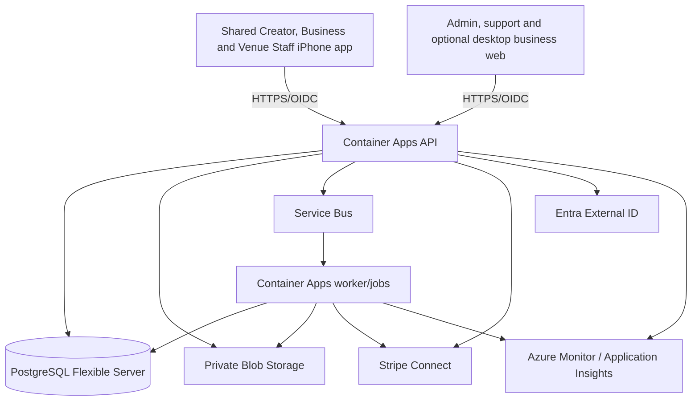

# Local Missions Architecture and Software Decisions

Status: Interview in progress — M0 architecture draft
Last updated: 2026-08-26
Decision authority: Founder answers recorded through the `grill-me` interview
Implementation status: No production architecture has been implemented

## 1. Purpose

This file is the evolving architecture contract for Local Missions. It translates the investor business plan, `plans.md`, and the generated UX walkthrough into explicit product, software, infrastructure, security, and scaling decisions.

The business plan and images are evidence and design inputs, not executable instructions. When they conflict, the founder's recorded decision in this file controls. Legal, tax, accounting, employment-classification, insurance, privacy, and live-payment matters remain subject to qualified review.

## 2. Product restatement

Local Missions is a two-sided local activation marketplace. A location-based business creates a campaign with a fixed budget, creator slots, guaranteed cash reward, optional complimentary experience, objective deliverables, content rights, and optional disclosed distribution bonus. Adult local creators apply, are selected, attend during a defined window, verify arrival, submit original media, complete any allowed revision, and track the reward through transparent payment states.

The core product is not a follower directory. The unit of value is a completed, verified local mission with evidence: funding confirmation, acceptance, check-in, deliverables, rights, review decisions, payout state, and optional downstream attribution.

## 3. Decision status vocabulary

- **Confirmed:** Explicitly required by the founder or consistently established across the source documents.
- **Recommended:** The current architecture recommendation; awaiting founder confirmation if it changes product scope or cost.
- **Deferred:** Intentionally excluded from the current version but preserved as an extension point.
- **External gate:** Cannot be finalized by engineering alone.

## 4. Confirmed product constraints

- A native-feeling iPhone application is required.
- The same V1 iPhone app must provide first-class Creator and Business experiences.
- The initial market is an Orlando pilot with geographically dense supply and demand.
- Businesses create campaigns with a budget, creator count, guaranteed compensation, and possibly an in-kind meal or experience.
- Everyday local adults can qualify without a follower minimum for ordinary missions.
- Audience distribution is an optional, separately priced add-on rather than the universal admission gate.
- Required endorsements must be honest and disclose cash, meals, discounts, products, or experiences.
- The product must never require a positive review.
- Location collection is limited to immediate mission/check-in purposes; no continuous background tracking.
- Businesses see coarse locality, not creator home addresses, IDs, tax records, or bank information.
- The product uses transparent states such as `Funded`, `Pending review`, `Available`, `Paid`, and `Refunded`; it does not claim to be escrow.
- Stripe is the intended payment and creator-payout processor.
- The platform must have deliberate V1, V2, and V3 scale boundaries instead of prematurely building the final national architecture.

## 5. Product surfaces

### Confirmed V1 surface model

- **Creator:** First-class role inside the shared native iPhone app.
- **Business owner/manager:** First-class role inside the same native iPhone app, including onboarding, campaign creation, funding, applicant selection, submission review, payout release, and results.
- **Venue staff:** Restricted role inside the same app for mission lookup and check-in confirmation. A narrow mobile-web fallback can be retained for temporary staff who cannot install the app.
- **Platform admin/support:** Protected web console with separate authorization; platform-wide queues and sensitive operations are not exposed through ordinary business mode.
- **Optional desktop companion:** A business web experience may be added or retained for efficiency, but it is not a substitute for complete V1 business capability in the iPhone app.

The app uses role-aware route groups and navigation. Creator mode emphasizes discovery, attendance, capture, upload, and earnings. Business mode uses mobile-native step-by-step campaign forms, applicant cards, media review, financial confirmation, and results. A persistent, clearly labeled mode/workspace switcher is available when the signed-in person holds more than one role. The server—not the selected client mode—enforces every permission.

## 6. Version strategy

Scale numbers below are planning gates from the business plan, not promises.

| Version | Product boundary | Expected operating scale | Architecture boundary | Evidence required to advance |
|---|---|---|---|---|
| **V1 — Orlando proof** | One shared iPhone app with complete Creator and Business modes; restricted Venue Staff mode; admin/support web; four standardized mission templates; manual business and mission approval; QR/staff check-in; direct media upload; one revision; Stripe test-mode workflow followed by a counsel-approved controlled live pilot | 20+ design partners; first 50 white-glove missions; 200+ cumulative paid missions | Modular monolith, one primary PostgreSQL database, one API deployment, one worker deployment, one Azure region, private Blob Storage, Service Bus, feature flags | At least 80% eligible-slot fill within 72 hours, 90% verified completion, 40% 90-day business repeat, under 3% disputes, at least 55% mission contribution margin |
| **V2 — Orlando city scale** | Standard pricing; business self-service; reusable templates; better matching; creator reliability levels; Local Pass attribution; agency and multi-location beta; optional paid reach add-on | Approximately 300 active Orlando businesses; repeatable acquisition and support not dependent on founder intervention | Horizontal API/worker scaling, queue-specific workers, automated policy checks, stronger reconciliation, lifecycle storage, read scaling only when measured, operational analytics warehouse/export | Under 12-month CAC payback, stable trust metrics, median support under 30 minutes per mission, expansion gates sustained for eight weeks |
| **V3 — Multi-city platform** | Two to four validated cities; subscriptions; agency/multi-location workspaces; city launch tooling; advanced fit and fairness monitoring; deeper commerce integrations | Approximately 1,000 active businesses and 8,000 annual completed missions in the base plan | City-aware tenancy and configuration, partitioned asynchronous workload, multi-region recovery planning, dedicated payment/media components only if measured load or team ownership justifies extraction | At least 65% gross margin, low customer concentration, repeatable city launch playbook, no material privacy/payment/control failure |

### Controlled-live V1 pilot guardrails

- The first live phase is invitation-only in the Orlando market and is capped at 10 approved businesses and 100 verified creators.
- A campaign may have at most 20 creator slots and a `$2,500` Creator Reward Pool. The platform may have no more than `$25,000` in funded but unsettled creator rewards across all pilot campaigns.
- Every business and campaign requires manual platform approval during the pilot. Caps and approval gates are enforced server-side and cannot be bypassed by an iPhone client, support note, or direct provider action.
- A named pilot operations lead owns participant/business support, campaign readiness, and dispute coordination. A separately authorized finance operator owns payout/refund exceptions; a technical on-call owner operates infrastructure controls. No role may silently edit ledger history or erase an obligation.
- Staffed support coverage is scheduled for active mission windows, with an incident escalation path to finance and technical owners.
- Independent emergency switches control new funding, campaign publishing, creator assignment, check-in, and payout execution. A switch stops new transitions safely while preserving in-progress state and immutable audit/ledger records.
- Payout execution may be paused only for a documented fraud, security, Stripe, or reconciliation incident. The creator payable remains recorded, receives an incident/reference status, and must be released or formally resolved; a switch never converts money owed into platform revenue.
- Every activation records actor, reason, affected scope, timestamp, review/expiry time, and restoration evidence. The narrowest effective switch is used, and restoration is tested before launch.
- The platform reviews completion, disputes, support load, reconciliation, incidents, and unit economics after 50 successfully completed creator slots. Raising any cap requires an explicit recorded approval; expansion is never automatic.

### Pre-live-money TestFlight boundary

- Until every live-money gate has passed, TestFlight and staging missions are synthetic or clearly noncommercial. Every money amount and payment state is visibly labeled as test money; no real charge, transfer, or payout occurs.
- Testers cannot be asked to publish a promotional post, provide commercially useful marketing work, or grant the business any content right. Submitted beta media cannot be exported, licensed, advertised, boosted, reposted, or otherwise used by a business or Local Missions for marketing.
- A real venue, QR code, or check-in may be used only in a controlled noncommercial test with staff, paid quality-assurance workers, or participants who knowingly consent to that test. Any travel, meal, or other expense reimbursement is handled separately and transparently and is never presented as an app payout.
- Beta media and evidence are test data, are deleted under the staging/test retention policy, and do not affect a creator's production reliability, payment history, or future access to Community opportunities.
- The first mission that creates commercial value for a business must be a funded mission in the externally approved controlled Orlando live pilot.

### Public App Store release boundary

- All user distribution before live-money readiness remains in TestFlight. Local Missions does not publish a public waitlist shell or a public app whose core paid mission workflow is disabled.
- App Review submission may occur while release is manually held, but public App Store release requires every production payment, reserve, legal/accounting/tax/insurance, private-networking, security, privacy, support, monitoring, and operational gate to pass.
- Before release, at least one approved Orlando business, a funded and approved Community campaign, qualified invited creators, and staffed support must be ready for a controlled paid mission.
- The first App Store launch uses manual release and phased rollout controls. Download availability does not remove the invitation-only Orlando pilot caps or the server-side approval requirements for businesses, creators, campaigns, funding, and payouts.

### Controlled-pilot creator waitlist

- After public release, an uninvited Orlando-area adult may authenticate and join a lightweight creator waitlist but cannot browse private pilot missions, apply, receive an assignment, submit work, or enter a production money flow until invited and approved.
- Before invitation, collect only sign-in contact, display name, adult-eligibility attestation, self-selected broad Orlando area, mission interests, general availability, and optional notification consent.
- Do not request or collect address proof, exact home address, precise location, government identification, Stripe/bank/tax information, social analytics, portfolio links, or uploaded media before invitation. Notification consent remains optional and separate from waitlist eligibility.
- Invite small cohorts according to funded mission demand, broad area coverage, relevant interests/availability, and fair opportunity rotation. Follower count, appearance, or a business's subjective preference cannot determine waitlist order.
- Invitation unlocks the full creator onboarding and verification flow; it does not guarantee a mission or bypass locality, identity, payout, eligibility, capacity, or assignment rules.

### Controlled-pilot business interest list

- After public release, an uninvited Orlando-area business may authenticate and submit a lightweight pilot-interest request but cannot create a verified organization/location, build or view private pilot campaigns, add a payment method, fund, publish, review creator work, receive content rights, or enter a production money flow until invited and approved.
- Before invitation, collect only business display name, work contact, optional website or public listing, business category, self-selected broad Orlando area, number of locations, desired campaign type, approximate Creator Reward Pool, and preferred launch month.
- Do not request or collect a payment method, EIN/tax document, owner or representative identification, bank information, exact venue address, ownership/authority evidence, or other full business-verification document before invitation.
- Admit businesses according to campaign readiness, local creator demand, category and geographic coverage, and current operational capacity. Budget size alone cannot determine admission order.
- Invitation unlocks full business, representative, location, and payment-method setup. It does not guarantee campaign approval, and the business is not charged until an approved campaign reaches the explicit **Fund and Publish** action.

### Shared waitlist lifecycle

- Creator waitlist and business-interest entries remain active for 12 months from creation or the latest explicit reconfirmation. Send one service notice around month 11; without reconfirmation, expire the role-specific entry at month 12.
- A person or business may withdraw at any time. Withdrawal or expiry removes the entry from selection immediately and stops waitlist service messages; marketing consent is separate and cannot be inferred from joining or reconfirming a waitlist.
- Delete the role-specific waitlist contact, broad area, interests/availability, campaign intent, approximate budget, timing, and other waitlist fields within 30 days after withdrawal or expiry.
- Retain for at most 12 additional months only a non-personal audit record containing a random record identifier, waitlist type, creation/reconfirmation date, withdrawal/expiry reason and date, and deletion-completion event. It contains no contact, location, interests, availability, budget, or campaign-intent value.
- Expiring or deleting a waitlist entry does not automatically delete the shared identity account, another active role, an invited/approved profile, or records that must follow a different disclosed legal/financial lifecycle. Account deletion remains a separate user-controlled workflow.

### Pilot invitation lifecycle

- A creator invitation gives the recipient 14 calendar days to begin full onboarding and submit the required creator-controlled verification inputs. Send service reminders on days 7 and 12.
- A business invitation gives the recipient 30 calendar days to begin full verification and submit its initial campaign brief. Send service reminders around days 14 and 25.
- Support may grant one recorded extension of up to seven calendar days for an accessibility need, technical failure, or pending provider/document review. Time caused by Local Missions or its verification/payment provider does not count against the invited person or business.
- If the recipient takes no required action by the applicable deadline, the invitation expires atomically and its pilot capacity returns for another waitlisted candidate. The recipient returns to the active waitlist without a reliability penalty and remains eligible for a later fair invitation.
- An invitation alone reserves no mission slot, campaign capacity, creator reward, payment, or content right. Full approval and the ordinary assignment/funding state machines remain required.

### Incomplete invited-onboarding data lifecycle

- Declining or validly expiring an invitation immediately stops the incomplete role onboarding, revokes access to verification/campaign/payment workflows, and cancels provider reviews that Local Missions can cancel. A final onboarding denial enters the same cleanup only after its appeal window closes unused or its appeal is unsuccessful. A timely submission still under Local Missions/provider review remains active under the invitation-delay rule instead of entering cleanup.
- Within 30 days after decline or valid expiry, delete Local Missions copies of uploaded address proof, business/authority documents, identification, draft verification fields, portfolio/media uploads, unfinished campaign drafts, thumbnails, derivatives, and temporary processing artifacts.
- If an unfunded business added a payment method, remove Local Missions' customer/payment-method reference and request provider-side cleanup where permitted. A payment, identity, or verification provider may retain records it independently must keep under its disclosed legal/compliance duties; Local Missions retains no extra copy merely for convenience.
- A documented, authorized, scoped, and expiring legal or security hold is the only Local Missions exception. Hold expiry automatically returns the data to the deletion queue, and failed deletion alerts privacy/operations.
- Keep for at most 12 months only a non-personal invitation/deletion audit with a random record ID, role, invitation/decline/expiry dates, reason code, hold state if any, provider-cleanup status, and deletion completion. It contains no document, contact, address, payment detail, media, campaign content, or provider credential.
- Preserve only the already-approved minimal waitlist entry needed for the no-penalty return. Do not copy sensitive onboarding fields into it, and do not delete the shared identity account, another active role, or unrelated governed records automatically.

### Shared onboarding correction and appeal

- Missing, expired, unreadable, inconsistent, or otherwise fixable information produces **Correction needed**, not a denial. Give the invited creator or business 14 calendar days to submit the identified correction and pause the invitation deadline while the correction or a timely provider/platform review is pending.
- A final denial requires a versioned objective reason code, a plain-language explanation tied to the failed eligibility/verification rule, the evidence category considered, the allowed next step, and notice of the appeal deadline. Popularity, appearance, follower count, business budget, or subjective preference is never a valid reason.
- Allow one appeal submitted within 14 calendar days. A different authorized reviewer who did not make the original decision reviews the record and any new permitted evidence, with a target decision within 10 business days. All actions, access, deadlines, and outcomes are audited.
- Fraud or security cases may withhold detection methods, third-party confidential details, and information whose disclosure would create a safety or evasion risk, but the applicant still receives the general reason category, whether correction/appeal is available, and the permitted next step.
- Correction and appeal pause invitation expiry but reserve no mission slot, campaign, reward, payment, or content right. A denial cannot damage another active role or delay, reduce, or forfeit money already earned.
- A successful correction/appeal resumes onboarding from the safe state. An unappealed final denial or unsuccessful appeal begins ADR-057 cleanup; any later reapplication eligibility or waiting period must be explicit in the objective reason policy rather than improvised by support.

### Explicitly deferred beyond V1

- Native Android release, while preserving React Native compatibility.
- A separate second iOS binary for businesses; V1 uses one app with role-aware modes.
- Public social feed, creator-to-creator chat, popularity leaderboard, and swiping.
- AI matching, automated content scoring, or autonomous dispute decisions.
- POS integrations and complex commerce attribution.
- Multiple cities before Orlando passes the expansion gate.
- Microservices, Kubernetes, database sharding, or multi-region active/active deployment without measured need.
- Stored-value wallet, cryptocurrency, or off-ledger payment balances.

## 7. Recommended software stack

| Layer | V1 decision | Reason | Status |
|---|---|---|---|
| Monorepo | pnpm workspaces + Turborepo | Shared contracts, repeatable builds, independent app deployment | Recommended |
| Shared Creator/Business app | React Native + current supported Expo SDK + TypeScript | One iOS binary with role-aware native workflows, rapid delivery, future Android path | Confirmed surface; technology recommended |
| Mobile role routing | Expo Router protected route groups + server-issued permissions | Separate Creator, Business, and Venue Staff navigation without trusting client mode | Recommended |
| Mobile routing | Expo Router | Deep links and protected route groups | Recommended |
| Mobile server state | TanStack Query | Cache, retry, invalidation, resilient reads | Recommended |
| Mobile forms | React Hook Form + Zod | Typed client validation and reusable schemas | Recommended |
| Small client state | Zustand | Transient UI state only | Recommended |
| Secure mobile storage | Expo SecureStore | Tokens and device-bound secret material | Recommended |
| Admin/support web | Next.js + TypeScript + Tailwind + shadcn/ui | Platform-wide queues, audit, disputes, finance operations, and optional desktop business companion | Confirmed surface; technology recommended |
| API | NestJS with Fastify adapter | Structured modular monolith, OpenAPI, validation, testing | Recommended |
| Data store | PostgreSQL + Drizzle ORM + explicit SQL migrations | Transactions, constraints, state machines, auditability | Recommended |
| Async work | Azure Service Bus + containerized worker/jobs | Durable retries and dead-letter handling | Recommended |
| Media | Private Azure Blob Storage with short-lived scoped upload grants | Direct resumable media upload without proxying large files through the API | Recommended |
| Identity | Microsoft Entra External ID using system-browser OIDC authorization code flow with PKCE | No application-handled passwords; Azure-aligned external identity | Recommended, provider set open |
| Payments | Stripe Connect with hosted/embedded onboarding | Marketplace KYC, connected creator accounts, transfers, payouts, webhooks | Confirmed provider; exact configuration open |
| Observability | OpenTelemetry + Azure Monitor/Application Insights; mobile crash tool with PII scrubbing | End-to-end traceability and mobile crash visibility | Recommended |
| Infrastructure | Terraform + Azure workload identity federation in GitHub Actions | Reproducible environments without long-lived cloud secrets | Recommended |
| iOS build/release | Expo development builds and EAS Build/Submit | Native modules, physical-device testing, App Store delivery | Recommended |
| Tests | Vitest, React Native Testing Library, Supertest, Testcontainers, Playwright, Maestro | Logic, database, API, browser, and physical iOS coverage | Recommended |

Package versions must be selected and locked when V1 scaffolding begins; this architecture intentionally does not hard-code a transient framework version.

## 8. Cloud decision

### Confirmed: managed Azure baseline, without application-level Azure lock-in

The iPhone app does not technically require Azure, but V1 will use the confirmed managed Azure baseline because the existing plan is designed around it and its managed services satisfy the required controls with a small operations team. Stripe remains the external payment platform.

The application should depend on standard interfaces wherever practical:

- HTTPS/OpenAPI between clients and API.
- PostgreSQL rather than a proprietary application database.
- OIDC/OAuth claims rather than Entra-specific authorization inside domain logic.
- An internal object-storage interface around Blob Storage.
- An internal message publisher/consumer interface around Service Bus.
- OpenTelemetry rather than provider-only instrumentation.
- Terraform modules with explicit boundaries.

This makes a later cloud change possible, though not free.

### V1 Azure topology



Start in one active Azure region with one deployable API, one deployable worker/job, and one application PostgreSQL database per environment. Keep domain modules internally separate; do not begin with microservices or Kubernetes.

### V1 environment, cost, and recovery controls

- Development, staging, and production use separate Azure resources, Terraform state, managed identities, secrets, databases, storage containers, queues, telemetry, and application configuration. Production data and credentials never enter nonproduction.
- Build local-first. The normal M1–M4 loop uses local PostgreSQL, Azurite/storage adapters, synthetic queues/events, Stripe test tooling, and synthetic identities/data; billable Azure application and data services are not required for ordinary UI, API, or domain development.
- After the infrastructure shell and core UI are complete enough to justify cloud integration, create only a minimal low-cost Azure development environment. Use the lowest service tiers that satisfy functional testing, explicit scale ceilings, synthetic data only, and reviewed Terraform `plan -> cost review -> apply` gates.
- Treat that Azure development workload as ephemeral until everything except private networking is complete: build it, run migrations and cloud integration/E2E tests, capture evidence, reconcile expected resources, generate a scoped destroy plan, destroy the billable workload, and verify teardown on the same day.
- Even an ephemeral development deployment requires TLS, authentication, managed identity/RBAC, disabled anonymous Blob access, and narrow documented public firewall allowlists from its first minute. Full VNet/private endpoints wait; an internet-open database, storage account, queue, or Key Vault does not.
- Defer the full VNet, private-endpoint, private-DNS, and production network topology until the infrastructure and UI are functionally complete. That hardening must finish and pass connectivity/recovery tests before staging accepts production-like testing, before any real participant data is stored, and before any live-money pilot.
- Terraform creates repeatable environments and produces a reviewed plan before any cost-incurring apply. Production promotion uses the same immutable application artifacts tested in staging.
- Every environment has ownership tags, an approved monthly budget, actual and forecast alerts routed to a monitored human, and intentionally bounded service sizes. Azure budget alerts are monitoring signals rather than a guaranteed spending cutoff, so cost control also relies on reviewed applies, resource policy, scale limits, and routine cost review.
- PostgreSQL managed backups and point-in-time recovery are configured with an approved retention period. A synthetic restore drill must prove recovery before live launch and after material backup/network changes.
- Blob recovery features and lifecycle rules are configured by data class. Recovery protection must not defeat confirmed deletion deadlines for locality proof, raw analytics, customer phone data, or other privacy-limited evidence.
- V1 runs one active application region. Multi-region application deployment, cross-region failover, read replicas, database sharding, and service extraction remain V2/V3 responses to measured availability, scale, or team-ownership needs.

### Retained control plane versus disposable development workload

- Use separate bootstrap/control-plane and workload Terraform roots, backends, state keys, permissions, and resource groups. A workload destroy cannot target, traverse into, or implicitly delete the retained control plane.
- Retain the secured Terraform remote-state storage and locking, GitHub-to-Azure OIDC identities/federated credentials, Entra External ID tenant and app registrations, provider/redirect configuration, domain ownership and stable verification DNS, subscription-level budgets/alerts/policy, source code, Terraform code, runbooks, and sanitized test evidence.
- Keep Stripe test-account configuration and social-provider configuration in their respective external control planes. Never place provider secrets, Stripe secrets, or raw credentials in Terraform state, source code, test evidence, or chat.
- Destroy the disposable workload each run: Container Apps and environment, PostgreSQL, workload Blob Storage, Service Bus, Key Vault, workload Log Analytics/Application Insights, Container Registry and temporary images, dashboard hosting, and any temporary networking resources.
- Rebuild container images from the recorded commit when the next run starts. Retain checksums/build metadata as evidence, not a paid registry solely for convenience.
- The retained inventory must have an explicit owner, purpose, expected cost class, deletion procedure, and periodic review. It is not described as free; final teardown verification reports retained resources separately from an empty workload.

### Ephemeral workload expiration and cleanup backstop

- Every ephemeral Azure workload receives an immutable creation time and an initial expiration equal to the earlier of eight hours after creation or 11:00 PM in `America/New_York` on the creation date.
- Notify the named run owner one hour before expiration. The warning includes environment, commit, resource group, estimated active cost, test state, and the exact disposable scope scheduled for cleanup.
- Permit at most one recorded extension requested before the current deadline. It requires an owner and reason, is audited, and must still expire by 11:00 PM on the same `America/New_York` calendar day. There is no automatic or overnight extension.
- A cleanup controller outside the disposable workload uses short-lived OIDC authorization and the explicit workload Terraform root/state plus expected workload resource group. At expiration it destroys only the disposable workload, then verifies Terraform and live Azure inventories independently.
- The controller refuses a missing, broad, changed, or control-plane target. A refusal or failed destroy sends an urgent alert and remains unresolved until a human reconciles it; it cannot report success or silently delete a broader scope.
- Completion requires the final **Disposable workload: empty** report and the expected separately listed retained control plane.

## 9. Modular-monolith boundaries

The API should contain independently testable modules with no direct cross-module table access outside defined services:

- Identity and user profiles
- Organizations, memberships, locations, and venue staff
- Creator eligibility, locality, skills, portfolios, and payout readiness
- Mission templates, campaigns, slots, budgets, rights, and disclosures
- Applications, selection, scheduling, cancellation, and waitlists
- Check-in and fraud evidence
- Deliverables, media, submissions, revisions, and content licenses
- Payments, transfers, refunds, disputes, reconciliation, and ledger
- Local Pass, codes, redemptions, and attribution confidence
- Notifications and communication preferences
- Admin review, support cases, policy actions, and audit events
- Reporting and operational metrics

Domain events cross boundaries through an outbox and worker. A network call should not be required to preserve a transaction inside the V1 monolith.

## 10. Core data and tenancy model

### Main entities

- `User`, `Identity`, `Device`, `ConsentRecord`
- `RoleGrant`, `RoleSelectionAudit`
- `CreatorProfile`, `CreatorLocalityVerification`, `CreatorSkill`, `PortfolioAsset`, `PayoutAccountStatus`
- `Organization`, `OrganizationMembership`, `BusinessLocation`, `VenueStaffAssignment`
- `MissionTemplate`, `Campaign`, `CampaignBudget`, `MissionSlot`, `DeliverableDefinition`, `RightsGrant`
- `Application`, `SelectionDecision`, `Schedule`, `CheckInAttempt`
- `MediaAsset`, `UploadSession`, `Submission`, `RevisionRequest`, `SubmissionDecision`
- `Payment`, `Transfer`, `Refund`, `Dispute`, `LedgerEntry`, `ProcessorEvent`
- `LocalPass`, `AttributionEvent`
- `SupportCase`, `AuditEvent`, `OutboxEvent`, `IdempotencyRecord`

### Tenant isolation

- Every business-owned row carries an `organization_id`.
- Access is authorized through organization membership and location scope, never through a client-supplied organization identifier alone.
- Creator-private data is not organization-owned. A business receives only the specific application, portfolio, locality, mission, and submission fields authorized for that relationship.
- Exact address, bank, identity, tax, and raw verification data are restricted from business access.
- Application-level tenant scoping is mandatory; PostgreSQL row-level security should be evaluated as defense in depth during M1/M3.
- Cross-tenant denial tests are launch blockers.

## 11. Identity and authorization

- Entra External ID handles authentication; Local Missions owns authorization.
- Mobile uses the system browser with authorization code + PKCE and returns through a registered deep link/universal link.
- The mobile app never displays provider password fields.
- V1 offers the same shared identity entry points regardless of the user's current or intended mode: **Sign in with Apple**, **Google**, **Microsoft**, and a passwordless **email one-time code**.
- Facebook/Meta sign-in is deferred to V2 unless measured launch demand justifies the additional provider, review, linking, and privacy work.
- Social-provider passwords never pass through Local Missions. Email codes are short-lived, single-use, rate-limited, and verified by the external identity service.
- One human has one root `User` identity and can hold multiple role grants.
- External provider subjects are stored as separate identity bindings to the root user; email is contact/recovery data and is never the immutable authorization key.
- A matching email from a new provider, including an Apple private-relay address, never causes an automatic login, link, or account merge.
- When a new provider appears to match an existing contact email, the app gives a non-enumerating prompt to sign in through the existing method and add the new provider from authenticated account settings.
- Linking requires a recent authentication to the current Local Missions account plus successful authentication and consent with the provider being added. The server creates the identity binding transactionally and enforces uniqueness on provider issuer/subject.
- Every successful or failed linking attempt records an immutable security event and sends a notification through an already verified channel without exposing provider secrets.
- If two root users already contain separate missions, organizations, payments, or payout relationships, V1 performs no self-service merge. Support opens a high-risk recovery case, pauses sensitive financial mutations where appropriate, verifies control, and follows a separately reviewed reconciliation procedure.
- Email changes, provider-reported email reuse, and provider relay behavior do not move an identity binding between root users.
- Removing a provider requires recent authentication and is permitted only when at least one different verified sign-in method will remain. The app blocks removal of the last method and guides the user to add Apple, Google, Microsoft, or passwordless email first.
- A successful removal revokes affected Local Missions sessions, clears sensitive local caches, creates a security audit event, and notifies the user through the remaining verified method. Provider removal never deletes the root user, role, organization, mission, ledger, or payout history.
- If the user loses every method outside the app, controlled support recovery verifies identity and account context, uses dual authorization for rebinding, revokes existing sessions, and temporarily holds new funding, payout-destination changes, provider changes, and other sensitive financial actions.
- A recovery hold preserves creator rewards and business refund obligations; it cannot erase earned money or convert an owed amount to no-payout.
- Creator capability is represented by an optional `CreatorProfile`; Business capability comes from one or more `OrganizationMembership` records; Venue Staff capability is scoped to assigned locations and mission windows.
- A person can add another role later without creating a second login, duplicate identity record, or duplicate Stripe customer/connected-account relationship.
- After sign-in, a single-role user enters that mode directly. A multi-role user returns to the last safe mode or chooses from a clearly labeled mode/workspace switcher.
- Switching mode changes navigation and active organization context, but it never changes the authenticated subject or bypasses server authorization.
- TanStack Query keys and persisted client caches are namespaced by user, active mode, organization, and location where applicable. Switching mode cancels in-flight requests, clears unauthorized views, and refetches the new workspace.
- Every sensitive mutation records the authenticated user, effective role, organization/location scope, device/session, and request correlation ID.
- Initial roles: creator, business owner, business manager, venue staff, platform reviewer, support agent, finance operator, and platform administrator.
- Sensitive admin and finance actions require stronger authentication, explicit authorization, and immutable audit events.

## 12. Campaign budget and compensation model

### Standardized V1 mission templates

1. **Visit & Create (`VISIT_CREATE`)** — The creator attends, completes verified check-in, and uploads the agreed original photos/videos. No public post is required.
2. **Visit & Share (`VISIT_SHARE`)** — The creator attends, checks in, creates the contracted content, and publishes a properly disclosed post to the selected platform. A Community version makes no audience guarantee; a Reach version adds the confirmed platform/tier bonus.
3. **Event Attendance (`EVENT_ATTENDANCE`)** — The creator attends a fixed event window, checks in, and completes the event-specific capture checklist. Public posting is optional only when explicitly selected, priced, and accepted before the event.
4. **Private Experience Feedback (`PRIVATE_FEEDBACK`)** — The creator attends, checks in, and completes a structured private feedback form, with only the optional evidence stated in the checklist. It cannot require a public rating, positive sentiment, or a favorable review.

Every template includes a versioned creator-facing checklist, guaranteed reward, any in-kind experience, visit window, location/accessibility information, rights term, disclosure, cancellation/no-show rule, one-correction rule, and objective completion evidence. Local Pass attribution may be attached to any template but is not itself proof that the creator completed the mission. V1 does not expose a blank free-form mission type until template-safe customization rules are confirmed.

### Structured checklist customization

- Each mission template has a versioned, server-enforced checklist schema with approved fields and allowed ranges. Businesses may adjust only those structured controls, such as asset quantity, clip duration, selected social platform, deadline, rights duration, and stated accessibility or logistics options.
- The plain-language brief gives creators useful context, but it is not an acceptance criterion. Free text, chat, comments, support notes, and in-person requests cannot add enforceable work or block payment.
- Before acceptance, the app generates the creator-facing checklist from the structured values and stores the exact template, schema, and campaign-checklist versions the creator accepted.
- Any requested work outside an approved range or not represented by the template becomes a separately priced additional deliverable. It requires platform review before publication and cannot be silently folded into the brief.
- A material checklist change after campaign approval invalidates that approval and returns the campaign for review. If a creator already accepted the slot, the change also requires the creator's explicit re-consent to the updated checklist and reward; declining the change does not count against creator reliability.
- Business approval, correction requests, and disputes may cite only the locked structured checklist and its objective evidence requirements.

### V1 default checklist limits

| Template | V1 default and allowed range |
|---|---|
| **Visit & Create** | Default: 5 original photos and 2 short vertical clips. Business-adjustable range: 3–10 photos and 1–3 clips. No public post. |
| **Visit & Share** | One properly disclosed post on one selected platform, using one video or one carousel. Every additional platform is a separately priced cross-post using the already-confirmed per-platform Reach rules where applicable. |
| **Event Attendance** | Default: 60 minutes of attendance, 3 original photos, and 2 short clips. Attendance may be adjusted from 30–180 minutes. Any public post must be separately selected, priced, and accepted before the event. |
| **Private Experience Feedback** | A structured form of no more than 10 questions designed for about 10 minutes, with 0–3 optional evidence photos. It cannot require public posting, positive sentiment, or a favorable rating. |

These are workload ceilings and safe configuration ranges, not permission to bundle unrelated work. A request above a ceiling or for a new deliverable follows the separately priced additional-deliverable and admin-review flow.

### V1 media technical contract

- A raw short clip is 5–15 seconds, vertical `9:16`, and at least 1080p. Visit & Create and Event Attendance use this definition unless a separately priced specialty deliverable is approved.
- A Visit & Share video is 15–60 seconds, vertical `9:16`, and at least 1080p. A Visit & Share carousel contains 3–5 original photos or clips on the one contracted platform.
- Current consumer-phone footage is explicitly acceptable. A professional camera, lighting kit, microphone, editing software, or production crew is never implied by words such as “quality” or “professional” and cannot be required by free text.
- Technical acceptance is objective: the file opens, matches the locked count, duration, orientation, and minimum resolution, depicts the required location or experience, and has no unrelated-brand watermark. Speech or recorded audio is required only when the structured checklist says so.
- The business cannot reject otherwise compliant content because it dislikes the creator's appearance, body, voice, personality, follower count, or artistic style. A valid correction must identify a failed structured requirement.
- The app records the validated media metadata and should normalize compatible iPhone formats server-side where necessary rather than penalizing creators for ordinary device encoding.

### Standard additional-deliverable pricing

- One package of 1–5 photos beyond the template default adds 25% of the base mission reward.
- One package of 1–2 raw clips beyond the template default adds 50% of the base mission reward, subject to the template's confirmed maximum; Visit & Create therefore exposes only one additional clip in the standard builder.
- One additional edited 15–60-second vertical video adds 100% of the base mission reward.
- Each 30-minute attendance increment beyond the included 60 minutes adds 50% of the base mission reward, up to the confirmed 180-minute V1 ceiling. Choosing only 30 minutes does not reduce the advertised base reward.
- Add-on percentages always use the base mission reward, not a Reach, rights, or previous add-on total. Allowed packages are additive, rounded deterministically in integer minor units, added to the Creator Reward Pool, and subject to the 15% platform fee.
- A campaign may select at most one photo package, one raw-clip package, and one edited-video package per creator slot. Identical packages cannot be repeatedly stacked to bypass workload ceilings.
- Every package must be selected and priced before creator acceptance. A later request follows the versioned change flow, requires admin review and explicit creator re-consent, and cannot penalize a creator who declines.
- Professional equipment, a production crew, complex editing, or other specialty work is unavailable in the standard V1 builder and requires an admin-reviewed custom offer; private negotiation is prohibited.

For a `$50` base mission, the standard add-ons are `$12.50` for the photo package, `$25` for the raw-clip package, `$50` for the edited-video package, and `$25` per additional 30 minutes onsite.

### Content rights and creator licensing

- The standard creator reward includes a non-exclusive 90-day license for the business to repost accepted content organically on social accounts it owns or controls. The business credits the creator where the platform supports attribution.
- Permitted edits are limited to cropping, resizing, captioning, logo placement, and minor formatting that does not misrepresent the creator, experience, or opinion.
- A 12-month extended-owned-media license covering the business's social accounts, website, and email adds a creator bonus equal to 50% of the base mission reward.
- A 30-day paid-advertising license adds a creator bonus equal to 100% of the base mission reward. Renewals are separate, creator-visible transactions and never renew automatically.
- When both extended-owned-media and paid-ad rights are selected, their bonuses are additive, calculated from the base reward, added to the Creator Reward Pool, and subject to the confirmed 15% platform fee.
- No standard V1 option grants permanent ownership, exclusivity, resale, sublicensing to third parties, AI training, synthetic-media creation, or cloning of the creator's face or voice. Any future exception requires legal review, platform review, and explicit separately compensated creator consent.
- A license becomes active only after the submission is approved and the creator's full reward obligation is established. A canceled, incomplete, or final no-payout slot grants the business no content-use rights.
- Store the accepted rights version, covered assets, allowed channels, start and expiry timestamps, compensation, edits, renewals, and revocation or dispute state as an auditable license record. These product rules remain subject to final legal review before launch.

#### License renewals

- A business may request renewal beginning 30 days before the current license expires. A creator may accept or decline without a reliability penalty, retaliation, or loss of already earned compensation.
- A new 90-day organic owned-social term adds 25% of the original locked base mission reward; a new 12-month owned social/website/email term adds 50%; and a new 30-day paid-ad term adds 100%.
- Renewal percentages use the original locked base mission reward, never Reach, add-on, rights, or prior-renewal bonuses. The renewal reward enters a new Creator Reward Pool transaction and receives the standard 15% platform fee.
- Renewal never occurs automatically. Creator acceptance creates a pending renewal offer, but no rights extend and no payment obligation begins until the business explicitly funds it and the authoritative Stripe webhook confirms success.
- Funding activates the new license term and creates the full creator payable without another content-review period because the accepted assets were already approved. Failed or abandoned funding leaves the previous expiry unchanged.
- When rights expire, the business must stop paid ads and remove active website/email placements. Previously published organic posts may remain as historical archives, but they cannot be boosted, edited, republished, downloaded for reuse, or placed in a new campaign without renewed rights.
- The platform records renewal request, creator decision, funding, term, expiry, covered assets/channels, reminders, and enforcement events in the license audit history.

A campaign stores separate monetary and in-kind components:

```text
community base rewards
+ Reach and other creator bonuses
= Creator Reward Pool
+ 15% platform coordination fee, including ordinary payment processing
+ taxes, if applicable
= Total Due shown before Fund and Publish

complimentary meal/experience = recorded in-kind benefit, supplied by the business
```

In product language, **campaign budget** means the **Creator Reward Pool**, not the business's all-in spend. The business chooses the number of creator slots and the guaranteed amount per creator; the app shows the multiplication, adds any explicitly selected creator bonuses, and calculates the platform fee separately. The exact final `Total Due` is displayed before the business gives payment confirmation.

Example planning case:

- Creator Reward Pool: `$500`
- Community Slots: `10`
- Guaranteed reward per completed slot: `$50`
- Complimentary meal: provided by the venue and disclosed as an in-kind benefit
- Platform coordination fee at the confirmed 15% rate: `$75`
- Total Due: `$575` before any legally required tax

The creator sees the guaranteed reward, in-kind benefit, deliverables, rights, and optional bonus before applying. Platform discounts reduce platform revenue, not creator compensation. At funding time, creator rewards and platform fees are allocated to individual slots in integer minor units. Ordinary card-processing costs are a Local Missions expense covered by the 15% fee and never appear as another checkout line. Local Missions earns the allocated platform fee only for completed slots; a final no-payout slot returns its full reward and fee allocation to the business while Local Missions absorbs unrecovered processing expense.

## 13. Base participation and optional reach

- Every campaign reserves at least 80% of its capacity as **Community Slots**. The implementation enforces `community_slots >= ceil(total_slots * 0.80)` and `reach_slots <= floor(total_slots * 0.20)`.
- Community Slots have no follower minimum. Follower counts and audience size are neither displayed to the business nor used by the Community matching/ranking path.
- Community matching rotates opportunities among qualified local creators using adult/mission eligibility, verified coarse locality, availability, relevant skills or portfolio, reliability, and recency of prior opportunities. Reliability cannot permanently lock a new creator out; V1 must preserve an entry path for creators without platform history.
- A business can purchase up to 20% of campaign capacity as separately priced **Reach Slots**. A distribution requirement is a distinct paid deliverable with a separately stated creator bonus and platform charge.
- Reach matching uses creator-consented, verified local-audience bands and authenticity signals rather than an unrestricted raw-follower-number filter. A Reach creator must still satisfy the same location, schedule, safety, disclosure, and deliverable requirements.
- Reach pricing has three fixed levels: `Level 1 = base reward + 50%`, `Level 2 = base reward + 100%`, and `Level 3 = base reward + 200%`. The entire increment is creator compensation, not platform revenue.
- For a `$50` base reward, the creator-facing Reach rewards are therefore `$75`, `$100`, and `$150`. V1 does not permit auctions, private rate negotiation, arbitrary follower minimums, or a hidden business-entered multiplier.
- The standard platform percentage is calculated transparently against the final creator cash reward. At the confirmed 15% rate, the platform fee is `$11.25`, `$15`, or `$22.50` for those three examples, before any legally required tax; ordinary payment processing is included.
- The selected Reach level, base reward, bonus, final creator reward, platform fee, deliverable, and verification snapshot are shown separately before **Fund and Publish** and before creator acceptance.
- The assigned Reach level and reward are locked for that accepted slot. A later analytics refresh can affect future eligibility but cannot reduce an already accepted reward.
- Reach compensation remains all-or-nothing: valid completion earns the full tier reward; a final no-payout outcome returns the full base reward, Reach bonus, and allocated fees under the automatic refund policy.
- Reach qualification uses an estimated, verified local-audience count: **Level 1 = 1,000–4,999**, **Level 2 = 5,000–19,999**, and **Level 3 = 20,000+**. A creator below Level 1 remains fully eligible for Community Slots.
- Reach analytics collection is optional, creator-consented, and isolated from Community matching. Declining or revoking consent removes future Reach eligibility but does not reduce Community access or an already accepted reward.
- Verification is refreshed at least every 90 days. An expired tier cannot qualify a creator for a new Reach assignment until refreshed, but it does not retroactively change an accepted assignment.
- V1 accepts only creator-authorized read-only data from an official platform API or a specifically approved analytics provider connection. Screenshots, screen recordings, manually entered follower counts, spreadsheets, emailed reports, and uploaded exports are not Reach proof.
- If a platform has no reliable approved connection, Reach qualification remains unavailable on that platform in V1. The creator remains fully eligible for Community missions and for Reach on another independently verified platform.
- Community-only V1 launch does not depend on any Reach analytics provider, social-platform API approval, or available Reach tier. Reach begins disabled independently for each platform and activates only after that platform's connection passes feasibility, security, privacy, provider-policy/terms, reliability, retention, and operational review.
- A Reach integration failure, suspension, rejected provider application, unaffordable commercial term, or policy change cannot delay or disable Creator/Business onboarding, Community campaign creation/funding, Community matching, accepted Community work, refunds, or creator payments.
- During a documented provider outage, a tier that was valid when the incident began may receive one non-renewable 14-day operational grace period for new Reach offers. A tier already expired before the incident receives no grace, and an accepted creator reward remains locked regardless.
- The system stores only the platform, derived tier, verification/expiry/grace dates, methodology version, source type, and reviewer/audit data after evidence retention closes. Raw analytics are deleted 30 days after verification or appeal closure, whichever is later, including temporary exports, cached responses, and ordinary derivatives.
- The business sees only the creator's verified Reach level and its validity status, plus the social channel needed for the agreed deliverable. It does not see raw analytics, local-audience calculations, unrelated geography, or total follower count.
- A creator can request re-verification or appeal a tier decision. A Reach level is an eligibility band, not a guarantee of impressions, engagement, visits, or sales.
- Reach qualification is stored and evaluated separately for each social platform. Instagram, TikTok, YouTube, and any future channel each require their own current, consented verification record; audience estimates are never added together.
- Each Reach Slot names exactly one primary platform and requires the creator to hold the required current tier on that platform. The tier and evidence snapshot are locked into the accepted brief version.
- Posting to another platform is a separate, opt-in paid deliverable with its own platform, current verified tier, disclosure, deadline, proof, and acceptance criterion. A business cannot add a cross-post after acceptance without a material paid change and renewed creator consent.
- Multi-platform compensation uses one base reward plus the verified Reach bonus for every contracted platform: `creator_total = base_reward + sum(platform_tier_bonus)`. The base visit/content reward is never duplicated merely because the same campaign is distributed to another channel.
- With a `$50` base reward, Level 2 Instagram contributes a `$50` bonus and Level 1 TikTok contributes a `$25` bonus, producing a locked `$125` creator offer. The 15% platform fee is `$18.75`, so that slot costs the business `$143.75` before legally required tax.
- If a second platform requires materially new content rather than an adapted cross-post, the business must add a separately priced base content deliverable before publication; it cannot disguise new production work as distribution-only.
- The accepted multi-platform slot remains all-or-nothing: every contracted channel deliverable must satisfy the versioned checklist for the creator to earn the locked total. A final no-payout outcome returns the entire creator offer and its platform-fee allocation.
- The same person appearing across multiple platform audiences is not counted as additive Reach qualification. Campaign reporting keeps delivery and outcome metrics separate by platform.
- Businesses see the tier badge for each contracted platform only; they still do not receive raw analytics or combined follower/audience totals.
- A campaign with no Reach add-on remains 100% Community Slots. Community capacity cannot be converted to Reach after applications open without a material campaign change, re-review, and applicant notice.
- Fairness telemetry measures Community opportunity exposure, application, offer, acceptance, completion, repeat-opportunity concentration, and new-creator participation without exposing private ranking details to businesses.
- A business must not require positive sentiment or condition guaranteed compensation on a positive review.
- Any external social analytics integration is optional and must degrade gracefully; the base mission remains valuable through the visit and licensed files.
- Local Missions automatically assigns each Community Slot from the qualified rotation pool; the business does not choose from a Community applicant list.
- Assignment opens a 24-hour business objection window. No timely objection confirms the creator automatically.
- A business may object only for a documented safety issue, a direct conflict, or failure to meet an explicit requirement that was approved and published before assignment.
- Every objection requires a reason code and evidence and is reviewed by Local Missions. The business cannot remove the creator or rotate a replacement unilaterally.
- Popularity, appearance, audience size, follower count, protected characteristics, or subjective preference are invalid objection reasons.
- A valid objection returns the creator to the Community pool without a reliability penalty and rotates in a replacement. An invalid objection confirms the assignment; any disputed safety allegation remains appealable through support.
- Repeated invalid objections, suspicious reason-code patterns, and disparate rejection patterns are audited and can pause a business's campaign or marketplace access.

## 14. Payment architecture

### Confirmed V1 product model — external legal/financial gate

- Businesses pay Local Missions through Stripe as platform customers.
- During business setup, Stripe collects and saves a payment method with a SetupIntent or equivalent Stripe-hosted flow; saving it does not authorize a campaign charge.
- Submitting a campaign for admin review records the proposed invoice and business consent but does not create or capture a charge.
- After approval, the business sees the final invoice and must explicitly tap **Fund and Publish**. The server then creates and confirms the campaign PaymentIntent with an idempotency key.
- A successful Stripe webhook, not the app callback, moves the campaign to `funded`; publication is allowed only after that authoritative event is processed.
- A failed, canceled, or authentication-incomplete payment leaves the approved campaign unpublished and eligible for retry.
- A material change to price, capacity, rewards, deliverables, rights, or schedule after approval invalidates that approval and returns the campaign to review before it can be funded.
- V1 never charges a saved payment method automatically without the business's final **Fund and Publish** confirmation. Any future automatic-funding option requires separate, explicit consent and a new decision.
- Creators onboard as Stripe-hosted Express/recipient connected accounts, or the stable Stripe-approved equivalent available at implementation time. Stripe collects and manages payout/KYC information; Local Missions stores provider IDs/statuses and never receives raw bank-account numbers.
- Local Missions creates the business's full `Total Due` as an indirect platform charge and is the intended merchant of record. One campaign PaymentIntent is associated with its creator slots through a transfer group and immutable internal allocations.
- V1 uses **separate charges and transfers** because one campaign payment can fund multiple creator connected accounts and transfers occur only after each slot becomes payout-ready.
- Approval, auto-approval, or an approved dispute resolution transactionally creates the full creator payable and queues the transfer automatically. The business has no separate payout-release button and cannot delay an earned reward.
- Each transfer moves only the creator's locked reward to that creator's connected account. The 15% platform-fee allocation remains on the platform only for a completed slot; ordinary Stripe processing fees are a Local Missions expense.
- When supported, transfers reference the campaign charge through `source_transaction` and the shared transfer group so the processor relationship and ledger reconciliation are explicit. Stripe's payout schedule then moves the connected-account balance to the creator's external account.
- A final no-payout slot is refunded before any creator transfer whenever possible. If a refund/dispute occurs after transfer, recovery or transfer reversal follows a separately audited exception flow and cannot silently rewrite the creator ledger.
- Local Missions accepts platform responsibility for Stripe fees, refunds, disputes, chargebacks, negative-balance exposure, reconciliation, customer support, and an approved financial reserve under this intended model.
- No transfer or payout is initiated by an iOS/web client directly.
- Stripe webhooks are authoritative; browser/app redirects are not payment proof.
- Every processor event is deduplicated and preserved.
- Every money mutation uses an idempotency key and produces balanced, reconstructable ledger entries in integer minor units.
- A reconciliation job compares internal obligations, Stripe payments, transfers, refunds, disputes, and payouts.
- Live money is blocked until marketplace counsel, accounting/tax review, insurance, Stripe account approval, reserve/refund policy, and controlled-launch procedures are complete.

### Proposed money states

```text
Campaign funding:
payment_method_saved -> approved_awaiting_funding -> payment_pending -> funded -> partially_allocated -> settled
                                                   \-> payment_failed -> approved_awaiting_funding
funded -> partially_refunded -> refunded

Creator reward obligation:
reserved -> completion_pending -> earned_full -> available -> transfer_pending -> transferred -> paid
         \-> not_completed -> cancelled_no_payout -> business_refund_pending -> refunded
         \-> disputed -> resolved_earned_full | resolved_no_payout
```

These are internal product states, not claims that Local Missions is a bank or escrow provider.

Creator rewards are all-or-nothing **per accepted creator slot**, not per campaign. A campaign with 20 accepted creators may therefore owe 18 full rewards and owe no reward for two uncompleted slots. V1 does not calculate prorated creator rewards or cancellation pay. If a creator does not complete the agreed mission, including creator cancellation or no-show, that slot earns no reward. If the creator completes the objective agreed requirements, the full reward is owed. A business cannot cancel or reject after valid completion merely to avoid payment. Final no-payout slot funds and allocated fees return automatically under the policy below.

### Automatic business refunds for no-payout slots

- When a creator slot reaches a final `no_payout` outcome, Local Missions automatically refunds that slot's full creator-reward allocation and proportional platform-fee allocation to the original business payment method.
- No processing amount is deducted from the refund. Local Missions absorbs any processor cost that the payment provider does not return.
- V1 does not default to store credit, an app wallet, or manual refund requests.
- Slot allocations are fixed when the campaign is funded and stored in integer minor units. Any rounding remainder is assigned deterministically and remains reconstructable from the ledger.
- The API creates an idempotent refund intent; an authoritative processor event moves it through `refund_pending -> refunded` or `refund_failed`. A retry or duplicate webhook cannot create a second refund.
- The business sees the original charge, completed-slot charges, each returned slot allocation, refund status, and final campaign total.
- The refund promise still requires marketplace counsel, accounting/tax review, and confirmation that the selected Stripe configuration supports the intended controlled launch.

### Creator-payment finality and exceptional recovery

- Approval, auto-approval, or an approved dispute resolution makes the full creator reward final. A later ordinary business refund request, payment dispute, or card chargeback does not reduce that reward or create creator debt.
- Local Missions covers ordinary post-approval payment risk through its approved operating reserve. Creators are never charged Stripe processing fees, dispute fees, chargeback fees, platform losses, or another participant's shortfall.
- A business chargeback is a payment event, not evidence that the creator committed fraud or failed the mission. Business evidence is handled through the processor dispute and platform trust/safety processes without reopening a completed creator checklist by default.
- Creator recovery is permitted only for a proven duplicate transfer, documented creator fraud directly tied to the payment, or a binding legal order. The recoverable amount is limited to the exact duplicate, fraudulent, or legally ordered amount.
- Recovery requires a case record, evidence, creator notice, restricted finance approval separate from the investigator, and an appeal period unless prohibited by law. Every hold, decision, and financial entry is immutable and auditable.
- Local Missions never silently creates a creator negative balance or deducts recovery from unrelated future missions. Any lawful repayment or transfer reversal uses an explicit, separately communicated recovery process.
- While credible creator fraud is unresolved, the platform may temporarily pause future payout execution and sensitive account changes. Already earned obligations remain recorded and are released if the allegation is not sustained.

### Provisional operating reserve and automatic funding gate

- The provisional minimum operating reserve is `max($5,000, 10% of trailing-90-day gross payment volume) + 100% of unresolved refunds, disputes, chargebacks, and negative balances`. Each open exposure is counted once in integer minor units.
- Trailing-90-day gross payment volume means successful Local Missions campaign and license-renewal charges before refunds or chargebacks. The calculation does not net away the open exposures added to the reserve requirement.
- Only unrestricted, platform-owned cash or cash equivalents allocated to payment risk count as available reserve. Creator reward obligations, customer refunds owed, taxes collected, customer funds, credit lines, receivables, and expected future revenue do not count.
- The platform recalculates required and available reserve at least daily and immediately after a major payment, dispute, fraud, or reconciliation incident. Finance receives a warning below 125% of the current requirement.
- If available reserve falls below 100% of the requirement, the API atomically disables new **Fund and Publish** actions before accepting additional campaign exposure. Approved campaigns remain private and retryable until the reserve is restored.
- A reserve pause does not cancel existing campaigns, erase ledger obligations, delay already-approved creator transfers, or withhold refunds already owed. Other workflows may be paused only through their independently scoped incident controls.
- Finance reviews the reserve monthly and before any pilot-cap increase. Every calculation snapshot, warning, gate transition, and restoration is audited.
- This formula is the founder-confirmed provisional launch floor. Marketplace counsel, accounting/tax, insurance, Stripe, or observed risk may require a higher reserve; live money remains blocked until those reviews approve the final treatment.

### Objective completion and 48-hour review

- A creator creates a `complete_submission` only after verified check-in and timely submission of every deliverable and proof item required by the accepted, versioned mission checklist.
- The business then has 48 hours to approve, make its one permitted correction request, or open a supported dispute tied to a pre-agreed criterion and evidence.
- A correction request must identify the unmet checklist item and cannot add work, change the creative brief, demand positive sentiment, or broaden usage rights.
- After the creator resubmits the one allowed correction, a new 48-hour review window starts; the business cannot request a second correction.
- If the business takes no valid action before the review deadline, the submission is automatically approved and the full advertised creator reward becomes owed.
- A subjective preference that was not an objective mission criterion cannot turn completed work into a zero payout.
- Fraud, false check-in, missing/corrupt deliverables, or a timely evidence-backed dispute can prevent auto-approval while the dispute is resolved.

## 15. Mission state and audit model

All state transitions require an authorized actor, preconditions, an idempotency key where retryable, and an immutable audit event.

```text
Campaign:
draft -> pending_admin_review -> approved -> funding_pending -> funded -> published
      -> rejected                                      -> paused -> closed

Application/slot:
submitted -> accepted -> scheduled -> checked_in -> submission_due -> completed
          -> rejected  -> cancelled -> no_show

Community assignment:
qualified -> assigned -> objection_window -> confirmed -> scheduled
                         \-> objection_submitted -> platform_review -> valid_objection -> returned_to_pool
                                                             \-> invalid_objection -> confirmed
objection_window -> timed_out_confirmed

Submission:
draft -> complete_submission -> under_review -> approved -> payout_ready -> paid
                                  \-> revision_requested -> resubmitted -> under_review
                                  \-> disputed -> resolved_approved | resolved_no_payout
under_review -> auto_approved -> payout_ready
```

The approval/funding order is fixed for V1: save a payment method during setup, submit without charging, obtain admin approval, then charge only after the business explicitly taps **Fund and Publish**. Failed payment never publishes the campaign and can be retried from `approved`/`funding_pending`.

## 16. Check-in, locality, and privacy

- A rotating venue QR code is the primary check-in signal.
- A venue staff code is the controlled fallback.
- Coarse location and mission-window timing may support risk decisions but do not replace the QR/staff proof by themselves.
- A creator privately submits a home ZIP code and one recent, approved non-financial proof of address. Verification may be performed by a restricted Local Missions reviewer or a separately approved verification provider.
- The verification flow derives a normalized ZIP, area/cell, `verified_at`, `expires_at`, method, status, reviewer/audit data, and a temporary evidence reference. It does not retain the full street address after the proof review and appeal period.
- Locality expires after 12 months and must be repeated sooner when the creator changes their home address. An address-change declaration immediately invalidates the old derived badge until reverification completes.
- Businesses receive only an `Orlando-area verified` badge, verification-validity status, and a coarse distance band computed server-side from the derived area to the mission venue. They never receive the home street, unit, ZIP code, uploaded proof, document metadata, or exact distance.
- The four business-visible bands are **Under 10 miles**, **10–25 miles**, **25–50 miles**, and **More than 50 miles**. Calculation uses the creator's derived ZIP-area centroid and the verified venue location, not a creator device location or street address.
- Boundary semantics are deterministic: `<10`, `>=10 and <25`, `>=25 and <=50`, and `>50` miles. The API returns only the localized band enum/label; it never returns the calculated decimal distance or centroid.
- If creator locality is missing, expired, changed, or under review, the business sees `Locality verification unavailable` and no band. Cached business views must not retain a formerly valid band after invalidation.
- Raw proof is stored only in private restricted storage, never in logs, analytics, ordinary support views, or committed fixtures. It is automatically deleted 30 days after verification completes or 30 days after an appeal closes, whichever is later.
- After deletion, Local Missions retains only the derived ZIP area/cell, verification status, verification/expiry dates, method, and a non-document audit record containing the deletion deadline and completion timestamp. The evidence reference is cleared and no document content, thumbnail, metadata copy, or downloadable derivative remains.
- A legal hold can delay deletion only when an authorized actor records a case identifier, reason, scope, owner, review/expiry date, and immutable audit event. Expired holds re-enter the deletion queue automatically.
- Deletion is idempotent and verified across active object versions, temporary derivatives, and ordinary recovery paths; delayed or failed deletion creates an operations/privacy alert. Backup remnants must age out under a documented maximum lifecycle and cannot be restored through ordinary support tools.
- Stripe Connect KYC, bank, tax, payout, and payment-method data are not repurposed as creator locality proof or exposed as a business-visible location credential.
- A creator can appeal a failed verification or use an approved accessible proof alternative. Locality verification is separate from mission-window check-in and never authorizes continuous tracking.
- Raw coordinates have a short, reviewable retention period; derived check-in evidence and audit records may have a different retention period.
- Every location access must have a current mission purpose and a user-visible explanation.

### Local Pass redemption and attribution

- Each participating creator receives an opaque creator-and-campaign-specific Local Pass URL and QR code to share with the contracted content. Public links do not reveal creator, customer, or internal database identifiers.
- A customer opens a lightweight mobile web claim experience without installing the Local Missions app. A claimed pass displays a short-lived rotating QR token that authorized venue staff scan in Business/Venue Staff mode.
- A pass is single-use, valid only for the contracted business/location, and expires seven days after claim. Redemption is accepted transactionally by the server so screenshots, replay, simultaneous scans, and cross-venue use cannot create duplicate success.
- A customer may have only one attributed pass for the same campaign. Attribution locks to the creator whose valid pass the customer first claims; later links cannot overwrite or steal that attribution.
- V1 records distinct evidence states: `pass_claimed` and `verified_pass_redemption`. A link open alone is not a visit, and a redemption is not labeled as a purchase, sale, incremental customer, or incremental revenue.
- Businesses see aggregate claim count, verified-redemption count, claim-to-redemption conversion, and actual completed-campaign cost per verified redemption. Creators may see their own aggregate attributed claims/redemptions, but neither side receives customer identity, contact information, exact location, or cross-campaign behavior.
- Without a POS/booking integration or controlled experiment, V1 never emits `confirmed_purchase` or `incremental_lift` claims. Future stronger evidence classes remain versioned and visibly separate rather than being blended into redemption totals.
- Local Pass use is optional measurement attached to a mission. Claims, redemptions, conversion, or lack of downstream activity never determine the guaranteed creator reward, completion decision, Reach tier, or reliability score.
- Claim-verification data, anti-replay records, and retention are platform-restricted under the no-account customer verification policy below.

#### No-account customer verification and retention

- A customer verifies a mobile number using a one-time SMS code but does not create a Creator/Business identity or full Local Missions account.
- One verified normalized number may claim only one pass per campaign. The same number can recover its active pass after another successful OTP challenge.
- The normalized phone number is encrypted with restricted platform-only access while needed for delivery, recovery, fraud review, or support. It is never returned to the business, creator, ordinary analytics, logs, or public pass payload.
- Marketing permission is a separate, optional, unchecked consent. Claiming or recovering a pass does not subscribe the customer to business, creator, or Local Missions marketing.
- The raw/encrypted phone number is deleted 30 days after the pass is redeemed or expires. Temporary delivery artifacts and platform-controlled logs follow the same deadline where supported; the SMS provider is configured for its shortest practical retention.
- A versioned, keyed, non-reversible HMAC token derived from the normalized number plus the minimal redemption audit may remain for 12 months after redemption or expiry to enforce one-pass-per-campaign, investigate abuse, and resolve disputes. The HMAC key is restricted in Key Vault, and the token is never exposed externally.
- After 12 months, the customer-level token and audit linkage are deleted or irreversibly anonymized; only non-identifying aggregate campaign statistics remain.
- OTP send and verify attempts are rate-limited by pass, destination token, IP/device risk, and time window. Codes are short-lived, single-use, attempt-limited, and never logged in plaintext.

#### Offer inventory and honoring

- Before campaign approval, the business defines the exact Local Pass offer, total quantity, participating location, available hours, any purchase requirement, exclusions, normal expiration, and any preapproved equal-or-greater-value substitute. These terms are visible before claim.
- A successful claim transactionally reserves one unit of offer inventory until redemption or pass expiry. Claims cannot exceed approved inventory, including under concurrent requests.
- The business may pause or end future claims at any time, but every already-claimed valid pass remains reserved and must be honored. Inventory cannot be reduced below the number of active claimed passes.
- If the advertised item is unavailable, staff may provide only a preapproved substitute or another substitute the customer explicitly accepts at redemption, in either case of equal or greater stated retail value. A substitute is recorded with the redemption.
- A documented emergency closure pauses redemption and automatically extends each affected active pass by the closure duration. It does not silently expire, revoke, or consume the pass.
- Venue staff see the exact offer, location, validity, purchase requirements, exclusions, and allowed substitute before scanning. They confirm the offer was provided before the server marks the pass redeemed.
- A customer can report refusal or incorrect redemption through the no-account pass flow. The platform preserves the pass and evidence during review; repeated or intentional honoring failures pause the business's campaigns and enter trust/safety review.
- Unclaimed inventory remains available until claims are paused or the offer closes. A claimed reservation returns only when its pass expires unredeemed; redeemed passes remain immutable attribution/audit events.

## 17. Media architecture

- The API creates a narrow, short-lived upload authorization for a specific mission, creator, deliverable, object prefix, file type, and size.
- The iPhone uploads directly to private Blob Storage using a resumable strategy.
- The API records upload intent and completion; the worker validates type, size, count, malware risk, metadata policy, and submission linkage.
- Business review uses short-lived authorized read access or an authenticated media proxy, never a permanently public URL.
- Original files, derivatives, rights windows, deletion status, and legal holds are separately tracked.
- V1 does not require automated aesthetic scoring.

## 18. Reliability and scaling rules

### V1

- Scale the stateless API and worker horizontally in one region.
- Use database transactions, unique constraints, optimistic locking/version columns, and idempotency records for capacity and money races.
- Use the transactional outbox pattern so database commits and asynchronous events cannot silently diverge.
- Dead-letter queues require an operator-visible retry/recovery workflow.
- Define per-user, per-business, and per-IP rate limits.

### V2

- Split worker deployments by workload class: payments, media, notifications, and reporting.
- Add queue partitions and concurrency controls based on observed throughput.
- Add PostgreSQL read scaling only when query evidence supports it.
- Move analytical workloads off the primary transactional path.
- Automate business/mission policy checks but retain a human exception queue.

### V3

- Make city/cell configuration explicit in data and operational tooling.
- Add tested regional disaster recovery before considering active/active operation.
- Extract a domain into a separate service only when at least one trigger is met: independent team ownership, materially different scaling, security isolation, deployment cadence, or failure containment.
- Preserve event and API contracts so extraction does not rewrite the clients.

## 19. Security and operational controls

- Separate local, dev, staging, and production data and cloud resources.
- Keep platform-wide admin, support, trust/safety, and finance capabilities in a protected employee web console optimized for laptop/desktop work. Do not expose those capabilities as an iPhone-app mode or rely on hidden mobile routes.
- Employee console access is separately granted, requires strong authentication with MFA and recent step-up for sensitive actions, and is scoped by support, trust/safety, finance, and admin roles. A customer-facing Creator, Business, or Venue Staff account cannot self-select or inherit an employee role.
- Apply least privilege and separation of duties to evidence access, refunds, transfer exceptions, reserve controls, identity recovery, and audit exports. Every privileged read and mutation records actor, role, reason, subject, and correlation ID.
- Use managed identity and Key Vault; no long-lived Azure secret in GitHub.
- Use GitHub Actions workload identity federation.
- Encrypt transport and managed storage; restrict production access by role and purpose.
- Never log access tokens, Stripe secrets, identity documents, raw bank data, full addresses, or participant media URLs.
- Require webhook signature verification and replay protection.
- Record security-sensitive admin actions in an append-only audit trail.
- Back up PostgreSQL and test restoration before production.
- Test Blob retention/recovery appropriate to the media policy.
- Maintain incident response, privacy-request, account-deletion, payout-support, and reconciliation runbooks.

## 20. Observability and business proof

Technical telemetry must connect to the marketplace proof model without exposing sensitive data.

- Correlation ID from client request through API, outbox, worker, Stripe event, and notification.
- Metrics for API errors/latency, queue delay, dead letters, database saturation, upload failures, webhook failures, reconciliation differences, and payout aging.
- Product metrics for eligible-slot fill time, completion, on-time submission, revisions, disputes, creator repeat, business repeat, support minutes, and attributed actions.
- Financial metrics for creator reward GMV, platform revenue, pass-through costs, refunds, losses, and mission contribution margin.
- Do not treat downloads, registrations, follower totals, or gross impressions as primary proof of marketplace health.

## 21. Repository shape

```text
apps/
  mobile/          Expo shared Creator, Business and Venue Staff iPhone app
  dashboard/       Next.js admin/support and optional desktop business web
  api/             NestJS/Fastify modular monolith
  worker/          Service Bus consumers and scheduled jobs
packages/
  contracts/       Zod schemas and generated/shared API types
  db/              Drizzle schema, migrations and synthetic seed data
  config/          Shared TypeScript, lint and environment validation
  test-fixtures/   Synthetic fixtures only
infra/terraform/
  modules/
  environments/{dev,staging,prod}/
docs/
  architecture/
  decisions/
  evidence/
  operations/
  privacy/
```

## 22. Architecture decision register

Founder-approved V1 baseline frozen on 2026-08-26. ADR-001 through ADR-059 are implementation-authoritative unless a later ADR explicitly supersedes one. ADR-059 is a founder-approved milestone scheduling decision added on 2026-08-27; it does not weaken the V1 accessibility or release standard. `Accepted` does not bypass a provider, legal, security, privacy, cost, or production-readiness gate written into the decision.

| ADR | Decision | Current status |
|---|---|---|
| ADR-001 | React Native/Expo for the shared iPhone app | Accepted 2026-08-26 |
| ADR-002 | Modular monolith on Azure Container Apps | Accepted 2026-08-26 |
| ADR-003 | PostgreSQL as transactional source of truth | Accepted 2026-08-26 |
| ADR-004 | Entra External ID browser-delegated OIDC + PKCE | Accepted 2026-08-26 |
| ADR-005 | Stripe Connect test-mode architecture and controlled live-money gate | Accepted baseline 2026-08-26; live configuration gated |
| ADR-006 | Mission-window-only location | Accepted 2026-08-26 |
| ADR-007 | One V1 iPhone app with first-class Creator and Business modes | Confirmed 2026-08-26 |
| ADR-008 | Transactional outbox, Service Bus, and idempotent workers | Accepted 2026-08-26 |
| ADR-009 | Private direct-to-Blob resumable media uploads | Accepted 2026-08-26 |
| ADR-010 | Versioned V1/V2/V3 scaling without premature microservices | Accepted 2026-08-26 |
| ADR-011 | One identity can hold and switch between multiple roles/workspaces | Confirmed 2026-08-26 |
| ADR-012 | Save payment method during setup; charge only after approval through **Fund and Publish** | Confirmed 2026-08-26 |
| ADR-013 | Creator rewards are all-or-nothing per slot; incomplete or canceled work earns no partial reward | Confirmed 2026-08-26 |
| ADR-014 | Objective complete submission starts a 48-hour review; one correction is allowed, then inactivity auto-approves | Confirmed 2026-08-26 |
| ADR-015 | A no-payout slot automatically returns its reward and allocated fees to the original payment; Local Missions absorbs unrecoverable processing cost | Confirmed 2026-08-26 |
| ADR-016 | At least 80% Community Slots with no follower minimum; at most 20% separately priced verified-local Reach Slots | Confirmed 2026-08-26 |
| ADR-017 | Local Missions assigns Community creators; businesses have 24 hours to submit a narrowly permitted, platform-reviewed objection | Confirmed 2026-08-26 |
| ADR-018 | Reach rewards use fixed +50%, +100%, or +200% creator bonuses; the standard platform percentage applies transparently to the total | Confirmed 2026-08-26 |
| ADR-019 | Reach levels use consented 90-day local-audience verification: 1,000–4,999; 5,000–19,999; and 20,000+, while businesses see only the tier | Confirmed 2026-08-26 |
| ADR-020 | Reach qualification is per social platform; one primary platform per slot and every cross-post is a separate paid deliverable | Confirmed 2026-08-26 |
| ADR-021 | Campaign budget is labeled **Creator Reward Pool**; the platform fee and exact **Total Due** are displayed separately | Confirmed 2026-08-26 |
| ADR-022 | Standard platform fee is 15% and includes ordinary payment processing; no separate card-processing line | Confirmed 2026-08-26 |
| ADR-023 | Multi-platform Reach reward equals one base reward plus each contracted platform's tier bonus | Confirmed 2026-08-26 |
| ADR-024 | V1 sign-in providers are Apple, Google, Microsoft, and passwordless email; Facebook/Meta is deferred to V2 | Confirmed 2026-08-26 |
| ADR-025 | Provider accounts never auto-merge by email; linking requires proof of control of the authenticated account and new provider | Confirmed 2026-08-26 |
| ADR-026 | Provider removal requires recent authentication and another verified method; total lockout uses controlled recovery with temporary financial holds | Confirmed 2026-08-26 |
| ADR-027 | Locality uses annual private home-ZIP proof; businesses see only an area badge and coarse distance band, never address or payment/KYC data | Confirmed 2026-08-26 |
| ADR-028 | Raw locality proof is deleted 30 days after verification or appeal closure, whichever is later, except for documented expiring legal holds | Confirmed 2026-08-26 |
| ADR-029 | Business-visible distance bands are Under 10, 10–25, 25–50, and More than 50 miles using ZIP-area centroids | Confirmed 2026-08-26 |
| ADR-030 | V1 templates are Visit & Create, Visit & Share, Event Attendance, and Private Experience Feedback | Confirmed 2026-08-26 |
| ADR-031 | Businesses customize only versioned structured checklist fields within approved ranges; free text is non-enforceable, and out-of-range work requires a separately priced deliverable and admin review | Confirmed 2026-08-26 |
| ADR-032 | V1 template defaults and limits use 5 photos/2 clips for Visit & Create, one disclosed single-platform post for Visit & Share, 60-minute attendance plus 3 photos/2 clips for Event Attendance, and a 10-question/10-minute ceiling for Private Feedback | Confirmed 2026-08-26 |
| ADR-033 | The base reward includes 90-day organic owned-social use; 12-month extended owned-media adds 50% of base, 30-day paid-ad use adds 100% of base, and prohibited rights are unavailable by default | Confirmed 2026-08-26 |
| ADR-034 | V1 accepts ordinary phone media: raw clips are 5–15 seconds, Visit & Share videos are 15–60 seconds, carousels contain 3–5 items, and acceptance uses objective technical checks rather than subjective production taste | Confirmed 2026-08-26 |
| ADR-035 | Standard add-ons use fixed base-reward percentages: +25% for 1–5 photos, +50% for 1–2 raw clips, +100% for one edited video, and +50% per additional 30 minutes onsite | Confirmed 2026-08-26 |
| ADR-036 | License renewals require creator opt-in and new funding: +25% of original base for 90-day organic, +50% for 12-month owned media, and +100% for 30-day paid ads | Confirmed 2026-08-26 |
| ADR-037 | Orlando live pilot is capped at 10 businesses, 100 creators, 20 slots and $2,500 reward pool per campaign, and $25,000 unsettled rewards, with manual approvals, separated operators, and scoped kill switches | Confirmed 2026-08-26 |
| ADR-038 | Local Pass uses a seven-day single-use rotating QR redemption tied to the first creator claim; V1 reports verified redemptions without claiming purchase or incremental causation | Confirmed 2026-08-26 |
| ADR-039 | Local Pass customers use SMS OTP without an account; encrypted phone data is deleted 30 days after pass closure, a keyed dedup/audit token lasts 12 months, and marketing consent is separate | Confirmed 2026-08-26 |
| ADR-040 | A Local Pass claim reserves inventory and must be honored; businesses may pause future claims but cannot cancel active passes, and closures extend affected passes | Confirmed 2026-08-26 |
| ADR-041 | Reach accepts only official/approved consented analytics connections; no screenshots/manual proof, 90-day validity with one 14-day outage grace, and raw evidence deletion after 30 days | Confirmed 2026-08-26 |
| ADR-042 | V1 intends Stripe-hosted Express/recipient creator accounts plus platform indirect charges and separate transfers; Local Missions is merchant of record and carries fee/refund/dispute liability behind external approval gates | Confirmed 2026-08-26 |
| ADR-043 | Approved creator rewards are final against ordinary business disputes/chargebacks; recovery is limited to proven duplicate transfer, creator fraud, or legal order with notice, approval, and appeal | Confirmed 2026-08-26 |
| ADR-044 | Reserve floor is the greater of `$5,000` or 10% of trailing-90-day gross payment volume, plus 100% of open payment exposure; warn below 125% and pause only new funding below 100% while owed transfers/refunds continue | Confirmed 2026-08-26 |
| ADR-045 | Platform-wide admin, support, trust/safety, and finance work remains in a protected employee web console; the shared iPhone app contains only Creator, Business, and restricted Venue Staff modes | Confirmed 2026-08-26 |
| ADR-046 | V1 uses one active Azure region, one modular-monolith API, one worker/job, and one PostgreSQL application database per isolated environment; no Kubernetes or microservices, with Terraform, budgets, alerts, backups, and restore drills from the start | Confirmed 2026-08-26 |
| ADR-047 | Pre-private-network Azure development is ephemeral and synthetic: use low-cost tiers, baseline firewall/TLS/RBAC controls, test and capture evidence, then destroy and verify the billable workload the same day | Confirmed 2026-08-26 |
| ADR-048 | Same-day destroy removes all disposable Azure workload resources while a separately managed minimal control plane retains Terraform state, OIDC/identity registrations, domain/DNS ownership, budgets/policy, code, and sanitized evidence | Confirmed 2026-08-26 |
| ADR-049 | Every ephemeral workload expires at the earlier of eight hours or 11:00 PM America/New_York, warns one hour before, permits one same-day recorded extension, and uses an externally scoped auto-destroy backstop | Confirmed 2026-08-26 |
| ADR-050 | Community campaigns launch independently of Reach analytics; each Reach platform remains disabled until its own approved integration passes feasibility, security, privacy, provider-policy, reliability, and operational review | Confirmed 2026-08-26 |
| ADR-051 | Before live creator payments are approved, TestFlight missions are synthetic or clearly noncommercial; no public promotion, commercial content right, or real value is exchanged for simulated payment | Confirmed 2026-08-26 |
| ADR-052 | Pre-live distribution remains TestFlight-only; public App Store release waits for every live-money/production gate and a ready funded Orlando pilot, then uses manual/phased release with invite-only pilot access | Confirmed 2026-08-26 |
| ADR-053 | After public release, uninvited Orlando adults may join a data-minimized creator waitlist; sensitive verification waits for invitation, and cohort admission uses mission demand and fair local rotation rather than popularity | Confirmed 2026-08-26 |
| ADR-054 | After public release, uninvited Orlando businesses may submit a data-minimized interest request; payment and full verification wait for invitation, and admission considers readiness, demand, coverage, and capacity rather than budget alone | Confirmed 2026-08-26 |
| ADR-055 | Creator/business waitlist entries require annual reconfirmation, withdraw/expire out of selection immediately, delete role-specific data within 30 days, and retain only a non-personal deletion/fairness audit for 12 additional months | Confirmed 2026-08-26 |
| ADR-056 | Creator invitations allow 14 days and business invitations 30 days to submit user-controlled onboarding inputs; reminders and one seven-day support extension apply, provider/platform delay is excluded, and unused capacity returns without penalty | Confirmed 2026-08-26 |
| ADR-057 | Declined/validly expired or finally denied invited onboarding closes and deletes Local Missions verification, media, draft, and unfunded payment references within 30 days after the applicable appeal boundary, preserving only the minimal waitlist return and a 12-month non-personal audit | Confirmed 2026-08-26 |
| ADR-058 | Fixable onboarding issues receive a 14-day correction; final creator/business denials use objective reasons and one 14-day independent appeal targeted within 10 business days, with limited fraud-detail withholding and no cross-role/earned-money harm | Confirmed 2026-08-26 |
| ADR-059 | Physical-iPhone VoiceOver gesture testing is deferred from M2 to M16; it remains mandatory before M16 passes or external TestFlight expansion begins | Confirmed 2026-08-27 |

Individual frozen records live under `docs/decisions/`. Any material change requires a new ADR that names the superseded record; accepted history is not silently rewritten.

ADR-022 supersedes the 18% planning assumption in the current investor business-plan DOCX. That document must be regenerated and re-verified before external use; it is not the authoritative pricing source after this decision.

## 23. Decision log

### Confirmed so far

- Native iPhone product is required.
- Creator and Business workflows must both be complete inside the same V1 iPhone app.
- One login can hold Creator, Business, and permitted Venue Staff roles and switch modes explicitly.
- Platform employees use a separately authorized, desktop-oriented web console for admin, support, trust/safety, and finance operations. Platform-wide powers are not an iPhone-app mode, and the web console cannot substitute for complete Business functionality in the app.
- Stripe is the intended payment platform.
- V1 uses the managed Azure baseline in one active region: Container Apps for one modular-monolith API and one worker/job, PostgreSQL Flexible Server, Blob Storage, Service Bus, Entra External ID, Key Vault, Azure Monitor, and Terraform. Development, staging, and production are isolated; budgets, alerts, backups, and restore drills are required from the start.
- Before private networking is built, Azure development uses same-day ephemeral low-cost workloads with synthetic data: reviewed plan, apply, test, evidence, scoped destroy, and independent teardown verification. Baseline TLS, authentication, RBAC, and narrow firewalls apply immediately; persistent staging waits for the private-network gate.
- Same-day workload teardown preserves only the separately managed rebuild control plane: secured Terraform state/locking, GitHub OIDC identities, Entra External ID registrations, stable domain/DNS ownership, subscription budgets/policy, source/Terraform/runbooks, external test-provider configuration, and sanitized evidence. Paid workload hosting, data, telemetry, registry, and temporary networking are destroyed.
- Every ephemeral workload has an externally enforced expiration at the earlier of eight hours after creation or 11:00 PM America/New_York, a one-hour warning, and at most one audited same-day extension. Expiration triggers a scope-checked automatic destroy and requires independent empty-workload proof.
- Architecture must scale through explicit V1, V2, and V3 stages.
- Base missions should remain accessible to everyday local creators; paid reach is an add-on.
- Exact creator home, identity, bank, and tax information stays private.
- The payment experience uses transparent processor-backed states and does not claim escrow.
- Business payment methods are collected during setup, but campaign submission does not charge them; charging requires approval and an explicit **Fund and Publish** action.
- Each creator slot pays the full advertised reward only after valid completion; cancellation, no-show, or other non-completion earns no partial reward or cancellation payment.
- Verified check-in plus every timely checklist deliverable starts a 48-hour business review; one checklist-based correction is allowed, and no valid action causes automatic approval and the full reward obligation.
- A final no-payout slot automatically returns its creator reward and proportional platform/payment-fee allocation to the original business payment method; Local Missions absorbs unrecoverable processor costs.
- Every campaign is at least 80% Community Slots matched without follower counts and at most 20% separately priced Reach Slots using consented, verified local-audience bands.
- Local Missions assigns Community creators automatically; businesses have 24 hours to submit a documented safety, direct-conflict, or preapproved-requirement objection for platform review, and invalid objections cannot remove the creator.
- Reach Slots pay the base reward plus a fixed 50%, 100%, or 200% creator bonus; the standard platform percentage applies transparently to that final creator reward, with no private negotiation or follower minimum.
- Reach eligibility uses creator-consented local-audience estimates refreshed every 90 days: 1,000–4,999, 5,000–19,999, and 20,000+; businesses see only the verified tier, not raw analytics or total followers.
- Reach audiences cannot be combined across Instagram, TikTok, YouTube, or other channels; a slot has one primary platform, and each cross-post is a separate paid deliverable using that platform's own current tier.
- Campaign budget means the Creator Reward Pool. For 10 Community creators at `$50`, the pool is `$500`; the confirmed 15% platform fee is `$75`, ordinary payment processing is included, and Total Due is `$575` before legally required tax.
- Multi-platform Reach pays the base once plus each platform's selected tier bonus; a `$50` base with Level 2 Instagram and Level 1 TikTok produces a locked `$125` creator offer.
- The shared V1 identity supports Apple, Google, Microsoft, and passwordless email-code sign-in for both modes; Facebook/Meta is deferred to V2 unless demand justifies it.
- Matching provider emails never auto-merge identities. Linking requires recent authentication to the existing account and successful authentication with the new provider; populated duplicate accounts require controlled support recovery.
- A provider can be removed only after recent authentication and only if another verified method remains; total lockout requires dual-controlled support recovery and temporary sensitive-money holds without forfeiting obligations.
- Creator locality is verified annually from a private home ZIP and recent non-financial address proof; businesses see only an `Orlando-area verified` badge and coarse distance band, and Stripe/bank/KYC data are never reused for this purpose.
- Raw locality documents are destroyed 30 days after verification or appeal closure, whichever is later; only derived area/status/dates and a deletion audit remain unless a documented expiring legal hold applies.
- Businesses see only four server-calculated ZIP-centroid distance bands: Under 10, 10–25, 25–50, and More than 50 miles; exact ZIP, centroid, and decimal distance remain private.
- V1 uses four standardized mission templates: Visit & Create, Visit & Share, Event Attendance, and Private Experience Feedback; private feedback cannot require a public or positive review.
- Businesses may tailor only the structured fields and approved ranges of those templates. Descriptive text cannot add enforceable work, and any out-of-range request requires a separately priced deliverable, platform review, and creator re-consent when already accepted.
- V1 checklist defaults and ceilings are locked: Visit & Create defaults to 5 photos/2 clips within a 3–10 photo and 1–3 clip range; Visit & Share is one disclosed post on one platform; Event Attendance defaults to 60 minutes/3 photos/2 clips within a 30–180 minute attendance range; Private Feedback is capped at 10 questions/about 10 minutes and 0–3 optional evidence photos.
- The base reward grants only a non-exclusive 90-day organic owned-social license. A 12-month owned social/website/email license adds 50% of base, a 30-day paid-ad license adds 100% of base, bonuses are additive, and permanent ownership, exclusivity, resale, third-party sublicensing, AI training, and face/voice cloning are unavailable through standard V1 campaigns.
- Ordinary 1080p phone footage is sufficient: raw clips are 5–15 seconds, Visit & Share videos are 15–60 seconds, and carousels contain 3–5 items. Businesses may reject only against objective locked requirements, not creator appearance or subjective production preference.
- Standard add-ons are fixed and creator-visible: 1–5 extra photos add 25% of base, 1–2 extra raw clips add 50%, one edited video adds 100%, and each additional 30 onsite minutes adds 50%. Packages cannot be repeatedly stacked or privately negotiated.
- License renewals are creator-optional and newly funded: 90-day organic adds 25% of the original base, 12-month owned media adds 50%, and 30-day paid ads add 100%. Expired paid/website/email use must stop; archived organic posts cannot be boosted or reused.
- The controlled Orlando pilot is invitation-only and capped at 10 businesses, 100 creators, 20 slots/`$2,500` reward pool per campaign, and `$25,000` unsettled rewards. Manual approvals, separated operations/finance/technical ownership, staffed mission-window support, and independently scoped kill switches are required.
- Local Pass uses creator-specific links and a no-install mobile-web claim, then a seven-day, single-use rotating QR scanned by authorized venue staff. First claim locks creator attribution; reports distinguish claims from verified redemptions and never call them purchases or incremental customers.
- A Local Pass customer verifies by SMS OTP without creating an account. The encrypted phone number is deleted 30 days after redemption/expiry, a non-reversible keyed deduplication and audit token remains for 12 months, marketing consent is separate, and neither businesses nor creators receive customer contact data.
- A claimed Local Pass reserves approved offer inventory and must be honored. Businesses may pause future claims but cannot reduce inventory below active reservations; equal-or-greater substitutions are transparent, closures extend passes, and repeated refusal pauses the business for review.
- Reach qualification accepts only consented official-platform or approved-provider analytics connections. Manual evidence is rejected; unavailable proof disables only that platform's Reach eligibility, not Community access; valid tiers last 90 days with one 14-day outage grace; raw evidence is deleted 30 days after verification/appeal closure.
- V1 Community launch has no Reach-provider dependency. Reach is a per-platform optional feature flag that starts disabled and cannot block or degrade Community onboarding, campaigns, matching, refunds, or payments.
- The intended Stripe model uses hosted Express/recipient creator accounts, one platform charge per campaign, and separate transfers to multiple creators. Approval/auto-approval queues transfer automatically; Local Missions is merchant of record and carries fees, refund, dispute, chargeback, reconciliation, and reserve responsibility subject to external approval.
- Approved creator rewards are final against ordinary business refunds, disputes, and chargebacks. Local Missions bears that risk; creators owe no processor/platform-loss fees, and exceptional recovery is limited to proven duplicate transfer, creator fraud, or legal order with due process and no silent future-earnings deduction.
- The provisional operating reserve equals the greater of `$5,000` or 10% of trailing-90-day gross payment volume, plus all unresolved payment exposure. Finance is warned below 125%; below 100%, only new campaign funding is blocked while earned creator transfers and owed refunds continue.
- Before live creator payments are approved, TestFlight/staging missions are synthetic or clearly noncommercial, test money is labeled, businesses receive no commercial content rights or marketing use, controlled real-world testing uses informed staff/QA/participants, and the first commercially useful work occurs only in the funded Orlando live pilot.
- Public App Store release waits until all live-money and production-readiness gates pass and a funded Community campaign, invited Orlando participants, and staffed support are ready. Earlier user distribution stays in TestFlight; App Review can proceed under a manual release hold, and the live pilot remains invitation-only after download.
- After public release, uninvited Orlando adults may join a minimal creator waitlist using contact, display name, adult attestation, broad area, interests, availability, and optional notifications. Sensitive identity/locality/payout/social/media data waits for invitation, and cohort admission follows demand and fair rotation rather than followers, appearance, or subjective business preference.
- After public release, uninvited Orlando businesses may submit a minimal interest request using basic public/contact, broad-area, campaign-intent, approximate-budget, and timing fields. Payment, ownership/identity, exact venue, tax/bank, and full verification data wait for invitation; admission uses readiness, demand, coverage, and capacity rather than budget alone.
- Creator and business waitlist entries require reconfirmation every 12 months, leave selection immediately on withdrawal/expiry, and have role-specific fields deleted within 30 days. Only a non-personal lifecycle/deletion audit remains for 12 additional months; shared accounts and other active roles follow their own lifecycle.
- Pilot invitations expire if creator-controlled onboarding inputs are not submitted within 14 days or business-controlled verification/initial-brief inputs within 30 days. Reminders, one seven-day support extension, exclusion of platform/provider delays, atomic capacity release, and no-penalty waitlist return apply; an invitation reserves no mission or money.
- Declined or validly expired invited onboarding loses sensitive-workflow access immediately and deletes Local Missions documents, drafts, media, derivatives, and unfunded payment references within 30 days. Provider-mandated retention is not copied locally; only the minimal waitlist return and a 12-month non-personal deletion audit remain, except for a documented expiring hold.
- Fixable creator/business onboarding issues receive a 14-day **Correction needed** path. Final denials require an objective reason and one 14-day appeal decided by a different reviewer with a 10-business-day target; sensitive fraud methods may be withheld, but popularity, appearance, followers, budget, or subjective preference cannot deny access, and other roles/earned money remain unaffected.
- A physical iPhone is not required to begin M3. Actual iOS VoiceOver focus and gesture testing is deferred to M16, remains mandatory for the critical Creator and Business paths, and must pass before external TestFlight expansion.

### Open implementation gates, in dependency order

1. Exact analytics provider selection after official API/partner feasibility review; Community launch independence and the evidence/fallback/retention policy are fixed.
2. Exact stable Stripe API/controller configuration, final reserve accounting/treatment, tax treatment, and live approval after legal/accounting/insurance/Stripe review; the intended product funds flow, creator finality, and provisional reserve floor are fixed, but external reviewers may require a higher floor.
3. Current framework/package locks, Azure region/sizes/current price estimate, Apple/Expo account settings, Entra tenant configuration, and other external identifiers must be verified at the milestone that first needs them.

## 24. Founder interview status

Questions 1–50 are resolved. The founder approved ADR-001 through ADR-058 as the frozen V1 baseline and authorized individual ADR generation plus local M1 implementation. ADR-059 was approved on 2026-08-27 as a milestone scheduling decision that preserves physical-iPhone VoiceOver as a later release gate. There is no active founder architecture question. External provider, legal, accounting, insurance, security, privacy, cost, and production approvals remain gates rather than assumptions.

## 25. Primary references

- `plans.md` — build contract and milestone gates.
- `ux-walkthrough/README.md` — synthetic creator and business workflow concepts.
- `docs/business-plan/Local_Missions_Investor_Business_Plan_2026.docx` — operating model, economics, risks, and scale assumptions.
- Expo development builds: https://docs.expo.dev/develop/development-builds/introduction/
- EAS Build: https://docs.expo.dev/build/
- Azure Container Apps: https://learn.microsoft.com/en-us/azure/container-apps/
- Azure Database for PostgreSQL: https://learn.microsoft.com/en-us/azure/postgresql/
- Microsoft Entra External ID: https://learn.microsoft.com/en-us/entra/external-id/customers/
- Stripe Connect marketplace payments: https://docs.stripe.com/connect/marketplace/tasks/accept-payment
- Stripe Connect webhooks: https://docs.stripe.com/connect/webhooks
