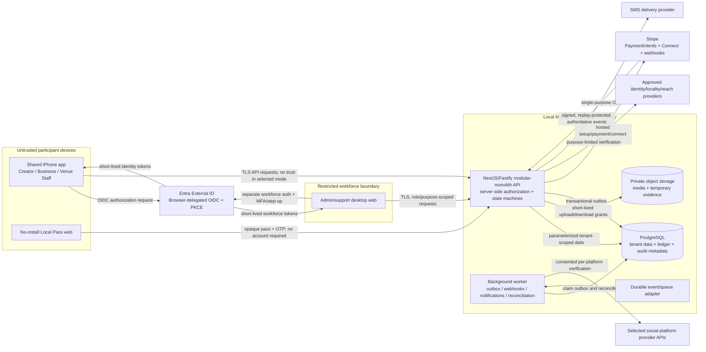

# Trust boundaries and V1 data flow

Status: M0 architecture evidence; implementation not yet verified  
Date: 2026-08-26

## Boundary rules

1. An iPhone route, role switch, callback, QR payload, or client-supplied organization identifier never grants authority. The API derives identity, active role grants, organization/location scope, object relationship, state, and policy version before every read or mutation.
2. Creator-private information is not business-owned. Businesses receive only relationship-scoped campaign/application/submission fields and coarse locality. Exact address, raw proof, identity, bank, tax, raw analytics, and exact distance remain restricted.
3. Provider redirects and app success screens are not payment proof. Only verified, deduplicated Stripe webhooks advance funding, refund, transfer, dispute, and payout states.
4. Media and evidence remain private. Access uses short-lived object grants; logs and analytics never contain participant media URLs, tokens, documents, raw coordinates, full addresses, or payment secrets.
5. The worker executes retriable side effects from an outbox/queue boundary. Idempotency keys and immutable audit events make duplicate delivery safe and reconstructable.
6. Admin/support/finance capability is not an app mode. It is separately granted, strongly authenticated, purpose-scoped, and audited in the workforce console.
7. Local development substitutes PostgreSQL, Azurite/private-storage adapters, synthetic queues/events, synthetic identities, and Stripe test tooling. Local fixtures contain no real personal, payment, or venue data.

## Critical data flows

### Fund and publish

`Business saves method -> campaign review -> approved invoice -> explicit Fund and Publish -> API PaymentIntent -> signed webhook -> balanced ledger allocation -> campaign funded/published`

No charge occurs during campaign submission. Failed or incomplete payment does not publish.

### Completion and creator payment

`Mission-window check-in -> complete objective submission -> 48-hour business review -> approve/auto-approve/resolved approval -> creator payable -> transfer queue -> Stripe connected account -> payout status`

The business cannot manually withhold an earned payment. Final no-payout slots instead produce an idempotent full slot reward-and-fee refund.

### Locality and check-in

`Restricted proof review -> derive ZIP area -> delete raw proof after review/appeal window -> expose only verified status + distance band`

`Mission-window QR/staff proof + optional coarse supporting location -> derived check-in result -> delete raw coordinates on the approved short schedule`

No background location path exists.

### Local Pass

`Opaque creator/campaign link -> SMS OTP claim -> reserved offer -> seven-day rotating QR -> authorized venue scan -> verified redemption event`

The business and creator receive no customer contact data. Claims and redemptions are separate measurements and are not payment, purchase, or causation proof.

## Highest-risk boundaries to test

- Cross-tenant and cross-role reads/mutations, including stale screens after a role switch.
- Replay or forgery of Stripe, identity, upload, check-in, and Local Pass inputs.
- Duplicate webhooks, retries, concurrent approval/refund/transfer actions, and ledger imbalance.
- Restricted evidence leakage through logs, analytics, support tools, object versions, backups, fixtures, and error responses.
- Workforce privilege escalation and separation-of-duties bypass.
- Any route that could charge, publish, transfer, refund, or expose commercial content before its gate.
