# Local Missions UX walkthrough

This folder turns the product plan in [`../plans.md`](../plans.md) into a visual, beginning-to-end walkthrough for the first paid mission. The existing images are synthetic concept artifacts created before the shared Creator/Business iPhone-app decision; the same workflow will be regenerated as native iPhone views during M2.

All people, businesses, missions, addresses, dates, balances, and media are synthetic concept data. These images describe intended product behavior; they are not final production UI or evidence that the implementation milestones are complete.

Before live creator payments are approved, the same boundary applies to TestFlight: missions are synthetic or clearly noncommercial, money is visibly marked as test money, testers are not asked to make public promotional posts, and no business receives a content license or marketing use. Real-world check-ins are limited to informed staff, paid QA workers, or consenting noncommercial testers. The first commercially useful mission occurs only in the approved, funded Orlando live pilot.

Before that funded pilot is ready, user distribution remains in TestFlight. Public App Store release waits for all live-payment and production gates, then uses a manually approved phased launch; downloading the app does not bypass the invitation-only Orlando pilot or its server-enforced caps.

Creator and business waitlist entries ask for reconfirmation around month 11 and expire at month 12 without it. Withdrawal or expiry removes the entry from selection immediately and deletes its role-specific waitlist data within 30 days. Marketing consent remains separate; expiry does not automatically delete the shared account or another active role.

If an invitation is declined or validly expires after partial onboarding, sensitive Local Missions documents, drafts, uploads, derivatives, and unfunded payment references are closed immediately and deleted within 30 days. A timely submission still under platform/provider review remains active. Only the pre-existing minimal waitlist record and a temporary non-personal deletion audit remain; another active role and the shared account are unaffected.

## Quick viewing order

1. Start with the shared role-choice screen.
2. Follow either the creator path or business path below.
3. Use the cross-role map to see where the two paths meet.
4. Watch the silent slideshow videos for a quick end-to-end pass.

- [Creator walkthrough video — 30 seconds](./video/creator-first-mission-walkthrough.mp4)
- [Business walkthrough video — 33 seconds](./video/business-first-mission-walkthrough.mp4)

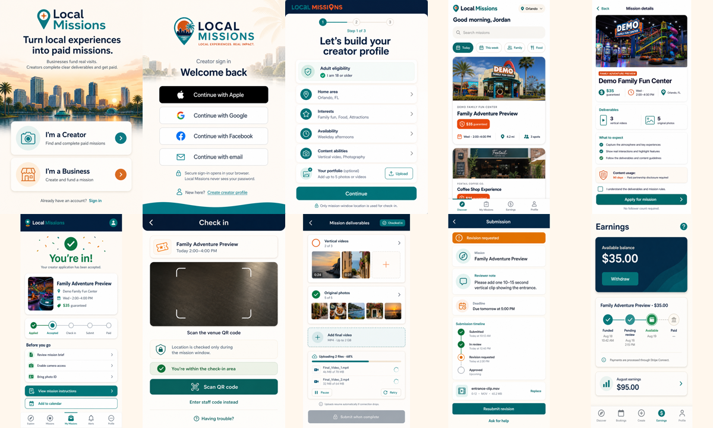

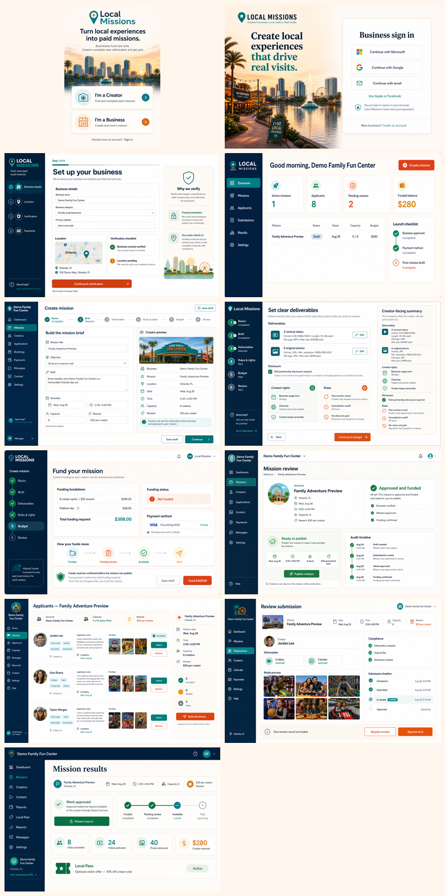

## Product idea

Local Missions lets an approved Orlando business create and fund a clearly scoped local experience. An adult creator applies, attends during a defined time window, verifies arrival, uploads the agreed original media, handles at most the allowed revision cycle, and tracks the reward until it is paid. The value is the verified visit and agreed deliverables—not followers, likes, or a public social feed.

## Cross-role journey

```mermaid
flowchart LR
    B1[Business signs in] --> B2[Verify business and location]
    B2 --> B3[Draft mission]
    B3 --> B4[Define deliverables and rights]
    B4 --> B5[Save payment method and submit]
    B5 --> A1[Admin review]
    A1 --> B6[Business funds and publishes]
    B6 --> C1[Creator discovers mission]
    C1 --> C2[Creator reviews terms and applies]
    C2 --> B7[Business selects creator]
    B7 --> C3[Creator accepts schedule and checks in]
    C3 --> C4[Creator uploads deliverables]
    C4 --> B8[Business reviews submission]
    B8 -->|Revision needed| C5[Creator revises and resubmits]
    C5 --> B8
    B8 -->|Approved| B9[Reward becomes available]
    B9 --> C6[Creator tracks payout]
```

## Sign-in and SSO behavior

The plan uses Microsoft Entra External ID with system-browser OIDC authorization code flow and PKCE for customer-facing identity. The shared iPhone app and admin/support console never collect or store a social-provider password.

V1 presents these shared identity options before customer-facing mode selection:

- Sign in with Apple.
- Continue with Google.
- Continue with Microsoft.
- Passwordless email one-time code.

Facebook/Meta sign-in is deferred to V2 unless measured demand justifies adding it.

Authentication uses a browser-based handoff followed by a secure return to the app or admin/support console. Matching email addresses never merge accounts automatically. To add another provider, the user must authenticate the existing account and the new provider; populated duplicate accounts require controlled support recovery. Removing a provider requires recent authentication and another verified method. Total lockout invokes controlled support recovery and temporarily pauses sensitive money actions without forfeiting money already owed.

Platform employees do not obtain admin, support, trust/safety, or finance powers from this customer mode switcher. Those separately granted roles exist only in the protected, desktop-oriented employee web console and require stronger authentication, MFA, step-up checks for sensitive actions, least privilege, and audited access. The iPhone app contains only Creator, Business, and restricted Venue Staff modes; businesses still complete their full campaign workflow natively.

These buttons are configuration choices, not automatic capabilities. Each provider must be enabled and configured in the External ID tenant and tested for account linking, cancellation, duplicate-email, and failed-return cases. Microsoft documents support for social and federated identity providers in [External ID for customers](https://learn.microsoft.com/en-us/entra/external-id/customers/) and its [External ID FAQ](https://learn.microsoft.com/en-us/entra/external-id/customers/faq-customers). Because the iOS app shows third-party sign-in, Apple’s [App Review Guidelines](https://developer.apple.com/app-store/review/guidelines/) and [Sign in with Apple guidance](https://developer.apple.com/design/human-interface-guidelines/sign-in-with-apple/) must be rechecked during implementation.

## Funding and payout trust model

The user goal is escrow-like confidence: the creator should know a reward was funded before doing the work, and the business should know the reward is not released until the defined workflow is complete. The plan intentionally does **not** make a legal escrow claim.

The product language is:

`Funded → Pending review → Available → Paid`

- **Funded:** the business-side funding confirmation succeeded through Stripe.
- **Pending review:** work was submitted and is awaiting a business decision.
- **Available:** approved reward is available to the creator under the configured Stripe Connect flow.
- **Paid:** Stripe reports the terminal payout state through authoritative webhook processing.

No production UI or marketing copy should use “escrow” unless licensed legal counsel and the final payment partner approve that exact structure and wording. The screens therefore show transparent money states instead of promising a regulated escrow account.

## Shared entry

### 00 — Choose a role

The first screen explains the two-sided marketplace in one sentence. The user chooses the creator iPhone path or business dashboard path. Returning users can go directly to sign-in.

Next: **I’m a Creator** opens screen 01. **I’m a Business** opens screen 10.

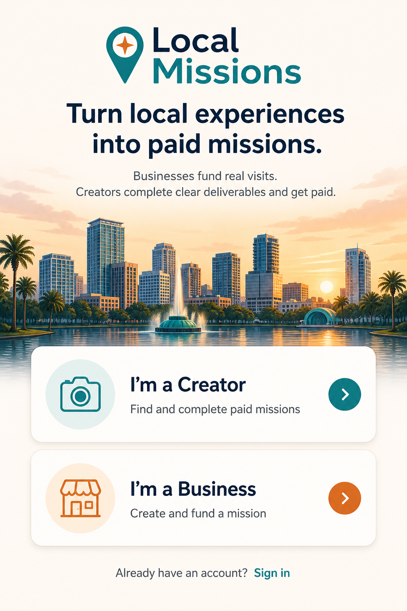

## Creator / participant path

### 01 — Secure creator sign-in

The creator selects Apple, Google, Microsoft, or passwordless email. Authentication opens in the system browser; the app does not display password fields or receive the provider password. The resulting identity can later add Business mode without creating another login.

After public release, an uninvited Orlando adult may join a lightweight waitlist using only a display name, 18-or-older confirmation, broad Orlando area, interests, availability, and optional notification consent. The waitlist does not collect address documents, exact location, identification, bank/Stripe/tax data, social analytics, portfolio links, or media. It does not expose private missions or money actions. Invitations are issued in small cohorts using funded mission demand, broad area coverage, interests/availability, and fair rotation—not follower count, appearance, or subjective business preference.

When invited, the creator has 14 days to begin onboarding and submit required inputs, with reminders on days 7 and 12. One seven-day support extension is available for accessibility, technical, or pending-review issues, and platform/provider delay does not count. An unused invitation returns to the waitlist without a reliability penalty and reserves no mission slot or reward.

Next: successful authentication returns to the minimal waitlist when uninvited, full onboarding when invited, or discovery for an approved account.

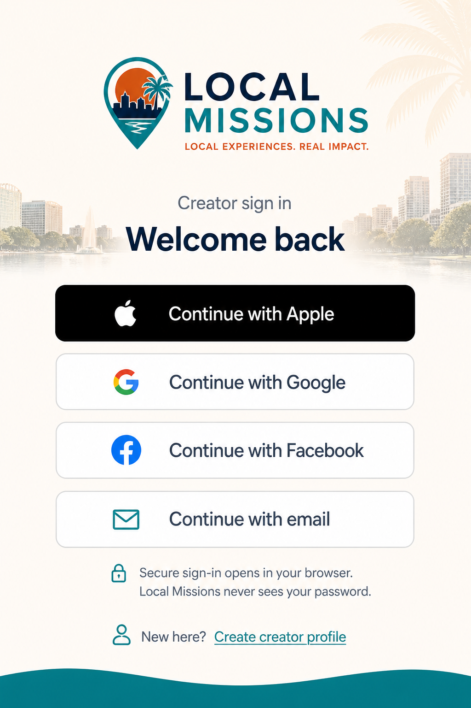

### 02 — Adult eligibility and creator profile

The creator confirms adult eligibility, home area, interests, availability, content abilities, and an optional portfolio. A private home ZIP plus one recent non-financial proof establishes annual locality; an address change triggers reverification. Businesses see only **Orlando-area verified** and a coarse venue-distance band—never the street address, ZIP, proof, or bank/Stripe data. Optional Reach verification uses separate creator-consented analytics refreshed every 90 days and assigns only a private local-audience tier. The privacy message introduces mission-window-only location before the user reaches check-in.

Fixable verification problems appear as **Correction needed** with the objective issue and 14 days to respond while invitation time pauses. A final denial explains the objective reason and allows one appeal within 14 days to a different reviewer, targeted within 10 business days. Fraud detection details may be limited, but popularity, appearance, followers, or subjective preference cannot deny creator onboarding, and another role or earned money is unaffected.

Next: completing the required profile fields unlocks eligible mission discovery.

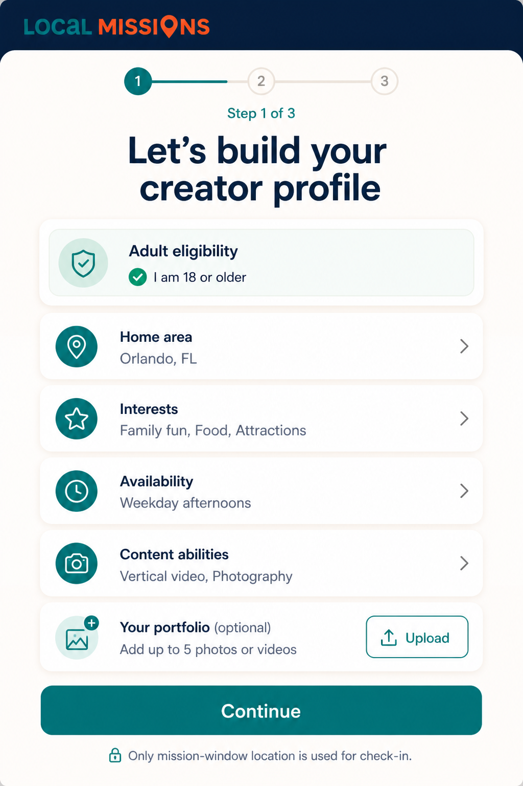

### 03 — Discover a mission

The feed leads with guaranteed reward, schedule, distance, capacity, and a clear mission title. Community Slots make up at least 80% of every campaign and rotate opportunities without follower counts; separately labeled Reach Slots can make up at most 20% and name one primary social platform. Instagram, TikTok, and YouTube tiers are verified separately, never added together, and each additional cross-post is shown as another paid deliverable.

Next: tapping **Family Adventure Preview** opens the complete mission contract.

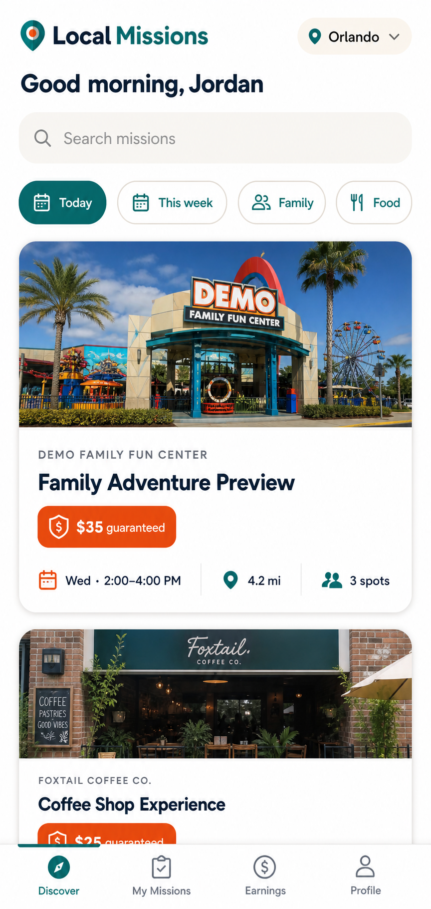

### 04 — Review terms and apply

Before applying, the creator sees the reward, time, location, deliverables, content-use term, disclosure requirement, and mission rules. A multi-platform Reach offer shows the base once and every platform bonus separately—for example, `$50 base + $50 Instagram + $25 TikTok = $125 total`. A consent checkbox prevents an accidental application.

Next: **Apply for mission** creates an application; it does not guarantee acceptance.

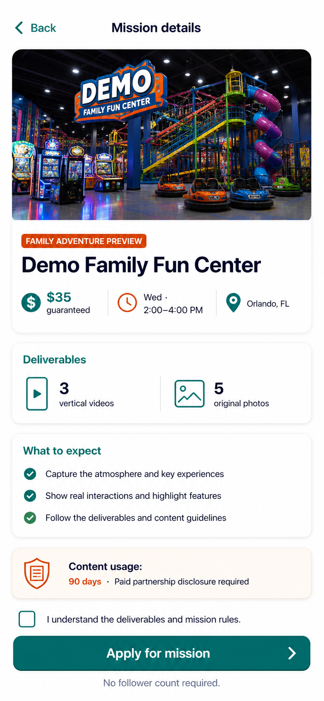

### 05 — Acceptance and schedule

The accepted state confirms the reward and visit window, then shows what the creator must prepare. The progress line makes the remaining stages visible.

Next: the creator reviews instructions, optionally adds the event to the calendar, and arrives during the mission window.

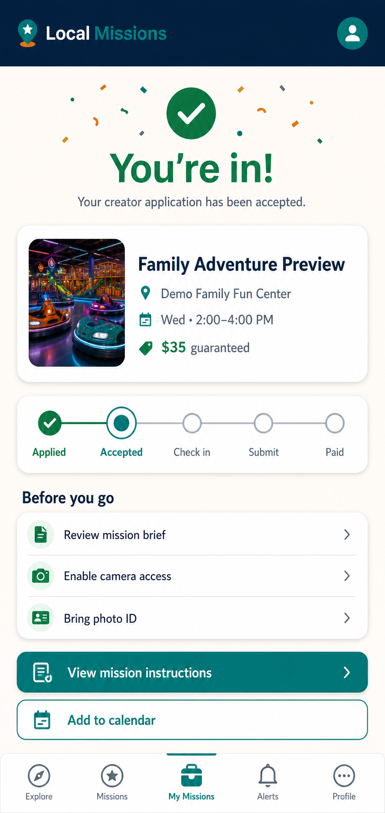

### 06 — On-site check-in

The default check-in scans a rotating venue QR code. A staff-code fallback supports camera or connectivity trouble. Location is evaluated only during the mission window and is not continuously tracked.

Next: a valid check-in unlocks the mission deliverables.

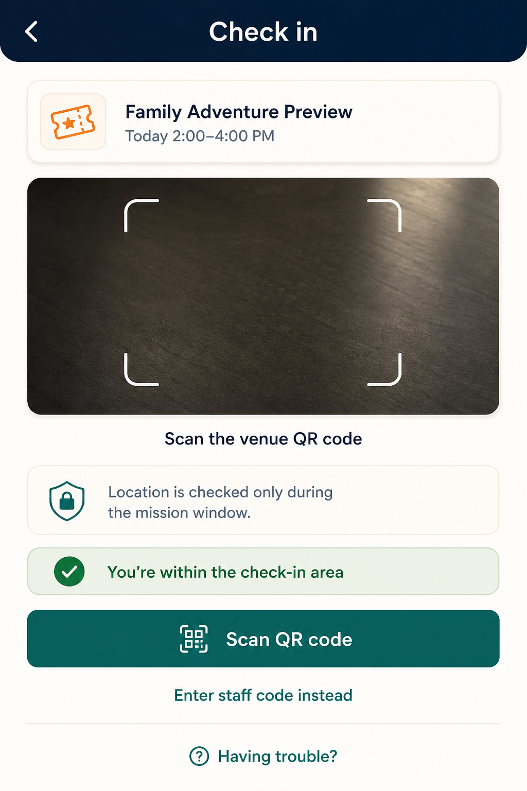

### 07 — Capture and upload deliverables

The creator sees an exact count of required videos and photos. Upload progress, pause/retry controls, and automatic resume communicate the resumable-upload requirement from the plan.

Next: submission is enabled only after all required deliverables finish uploading and validating.

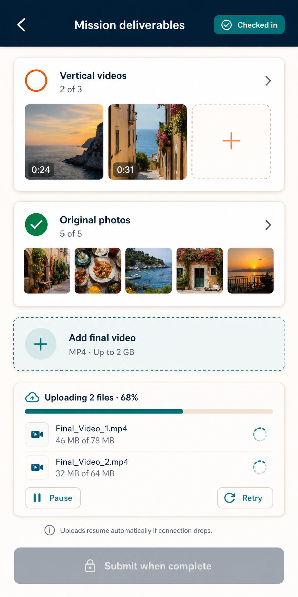

### 08 — Revision and resubmission

If the business requests the one allowed correction within its 48-hour review window, the creator gets one concrete checklist-based request, a deadline, the affected attachment, and a clear resubmit action. Support remains visible for disputes or unclear feedback.

Next: resubmission returns the work to business review without creating a second paid mission.

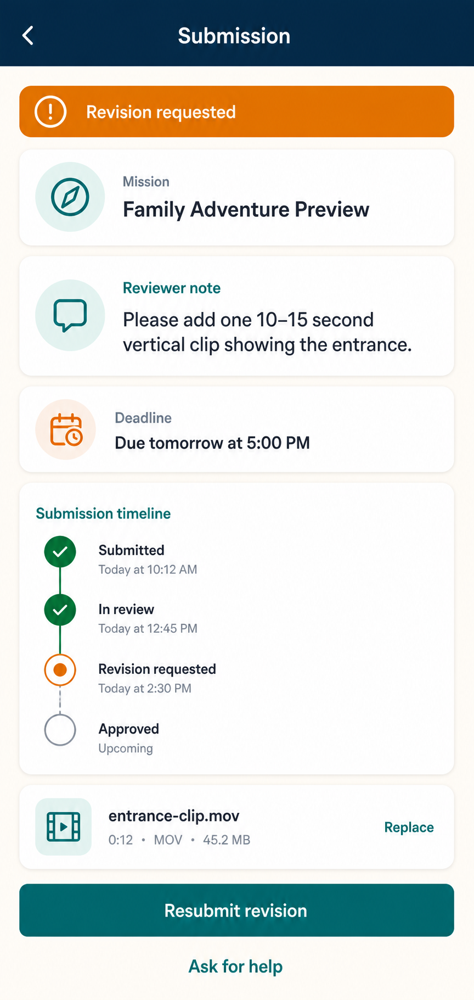

### 09 — Earnings and payout tracking

The creator can distinguish platform approval from actual payout. The same four money states appear on both sides, with Stripe Connect named as the payment processor. Once approved or auto-approved, the reward is final against ordinary business refund requests and chargebacks. Local Missions—not the creator—carries processing, dispute, and chargeback costs. Only a proven duplicate transfer, documented creator fraud, or legal order can begin a separately notified and appealable recovery case; the app never silently creates a negative balance or deducts from unrelated future missions.

Next: the reward advances from **Available** to **Paid** only after the authoritative payment event is reconciled.

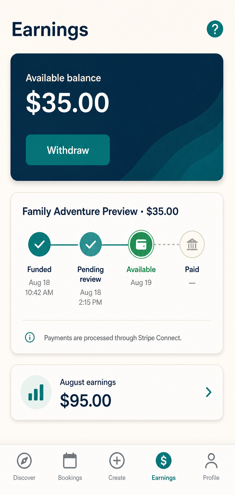

## Business path

### 10 — Secure business sign-in

Business users use the same Apple, Google, Microsoft, or passwordless email identity options as creators. Microsoft remains useful for a work account, but provider choice does not grant Business permissions. The browser handles authentication rather than an in-app password form.

After public release, an uninvited Orlando business may submit a lightweight interest request containing only its name, work contact, optional website/public listing, category, broad Orlando area, location count, desired campaign type, approximate Creator Reward Pool, and preferred launch month. It does not provide a card, EIN/tax document, owner identification, bank information, exact venue address, or full verification evidence. Interest-list admission considers readiness, local demand, category/geographic coverage, and operating capacity—not simply the largest budget.

When invited, the business has 30 days to begin verification and submit an initial campaign brief, with reminders around days 14 and 25. One seven-day support extension is available for accessibility, technical, or pending-review issues, and platform/provider delay does not count. An unused invitation returns to the interest list without penalty and reserves no campaign capacity or payment.

Next: successful authentication returns an uninvited business to its interest request, an invited business to full setup, or an approved returning business to the dashboard.

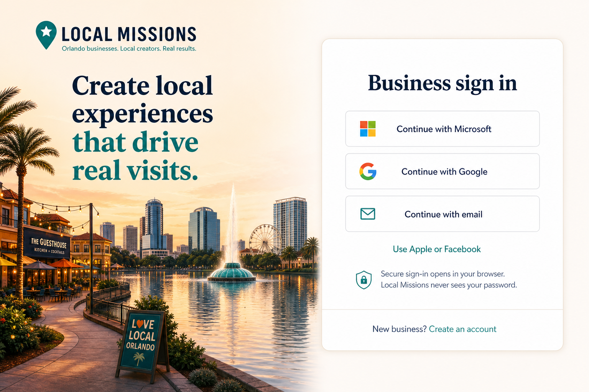

### 11 — Verify the business and location

The business provides its legal/display details and physical mission location. Verification protects creators from fake venues and makes location-bound check-in meaningful.

Fixable verification problems appear as **Correction needed** with the objective issue and 14 days to respond while invitation time pauses. A final denial explains the objective reason and allows one appeal within 14 days to a different reviewer, targeted within 10 business days. Fraud detection details may be limited, but budget size or subjective preference cannot deny business onboarding, and another role or earned money is unaffected.

Next: contact, location, business, and payment setup must satisfy the approval gate.

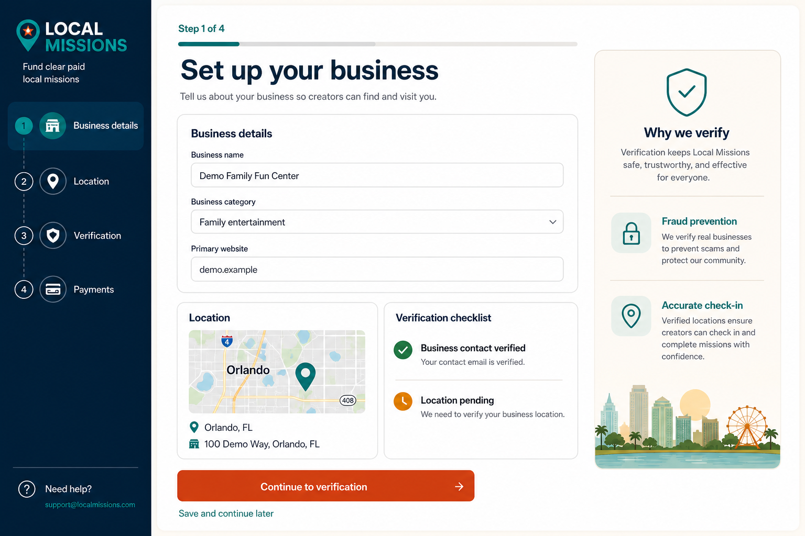

### 12 — Open the mission dashboard

The dashboard summarizes active work, applicants, pending reviews, and confirmed funding. A launch checklist tells a first-time business exactly what remains.

Next: **Create mission** starts the campaign wizard.

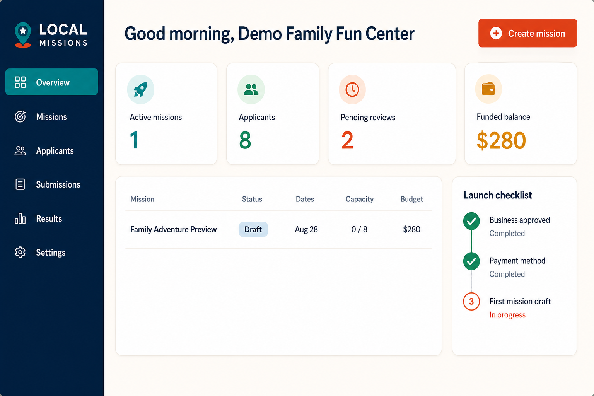

### 13 — Build the mission brief

The business starts from one of four V1 templates: **Visit & Create**, **Visit & Share**, **Event Attendance**, or **Private Experience Feedback**. It then defines the title, objective, plain-language brief, date, time, capacity, and per-creator reward. Visit & Create requires no public post; Private Experience Feedback cannot require a public or positive review. The brief provides context but cannot add enforceable work. A creator preview generated from the structured checklist reduces surprises before submission.

Next: continue to define the exact media contract.

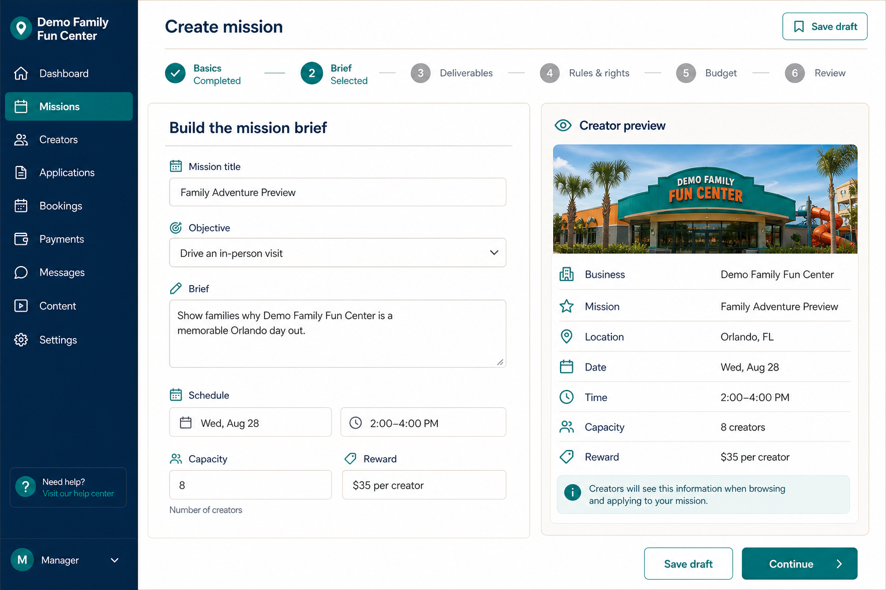

### 14 — Define deliverables, disclosure, rights, and rules

The business adjusts structured checklist fields—such as file counts, clip duration, selected platform, content-use duration, disclosure, revision, cancellation, and no-show rules—only within approved ranges. Visit & Create defaults to 5 photos and 2 short clips (allowed: 3–10 photos and 1–3 clips). Raw clips are 5–15 seconds, vertical 9:16, and at least 1080p. Visit & Share is one disclosed post on one selected platform using either a 15–60-second vertical 1080p video or a 3–5-item carousel. Event Attendance defaults to 60 minutes, 3 photos, and 2 clips (allowed attendance: 30–180 minutes). Private Feedback is capped at 10 questions/about 10 minutes and 0–3 optional evidence photos. A normal current phone is enough; professional equipment is not required. Fixed add-ons prevent private negotiation: 1–5 extra photos add 25% of base, 1–2 raw clips add 50%, one edited video adds 100%, and each additional 30 onsite minutes adds 50%. Package and template ceilings prevent repeated stacking. The base reward includes 90-day organic reposting on the business's social accounts. Twelve-month use across owned social, website, and email adds 50% of the base reward; 30-day paid-ad use adds 100%. Permanent ownership, exclusivity, resale, third-party licensing, AI training, and face/voice cloning are unavailable in the standard V1 builder. The right panel shows the locked checklist and license the creator will see and consent to. Free text, chat, comments, and venue requests cannot expand that contract. New or out-of-range work becomes a separately priced additional deliverable requiring admin review and, after creator acceptance, explicit creator re-consent. Compensation is all-or-nothing per creator slot: valid completion earns the full advertised reward; cancellation, no-show, or incomplete work earns no partial reward or usage license. Review reasons must identify an objective failed requirement; appearance or subjective style is not a valid rejection reason.

Beginning 30 days before license expiry, the business may request a creator-approved renewal: another 90 days of organic use adds 25% of the original base reward, 12 months of owned-media use adds 50%, and 30 days of paid ads adds 100%. The creator can decline without penalty. The renewal activates only after the business explicitly funds it; expired ads and website/email placements must stop, while an old organic post may remain only as an unboosted historical archive.

Next: continue to budget only after the creator-facing terms are complete.

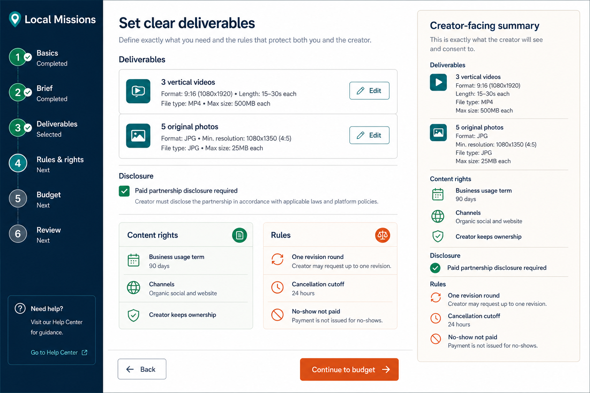

### 15 — Confirm the budget, save payment method, and submit

The calculation labels creator compensation as the **Creator Reward Pool** and keeps it separate from business fees. For 10 Community creators at `$50`, the screen shows `10 × $50 = $500 Creator Reward Pool`, `$75 platform fee` at the confirmed 15% rate, and `$575 Total Due` before legally required tax. Ordinary payment processing is included, so there is no separate card fee. Reach, add-on, and content-license bonuses are calculated independently from the base reward, added to creator compensation, and itemized before the fee is calculated. On a `$50` mission, the photo, raw-clip, edited-video, and extra-30-minute packages add `$12.50`, `$25`, `$50`, and `$25` respectively. Selecting both 12-month extended use and 30-day paid-ad use adds `$25 + $50`. During the controlled Orlando pilot, the builder enforces no more than 20 slots and a `$2,500` Creator Reward Pool per campaign. V1 saves the payment method here but does not charge it on submission. The rendered **Fund $308** button predates ADR-012 and is superseded; the implementation label is **Save payment method and submit for review**.

Next: the mission enters admin review without a charge.

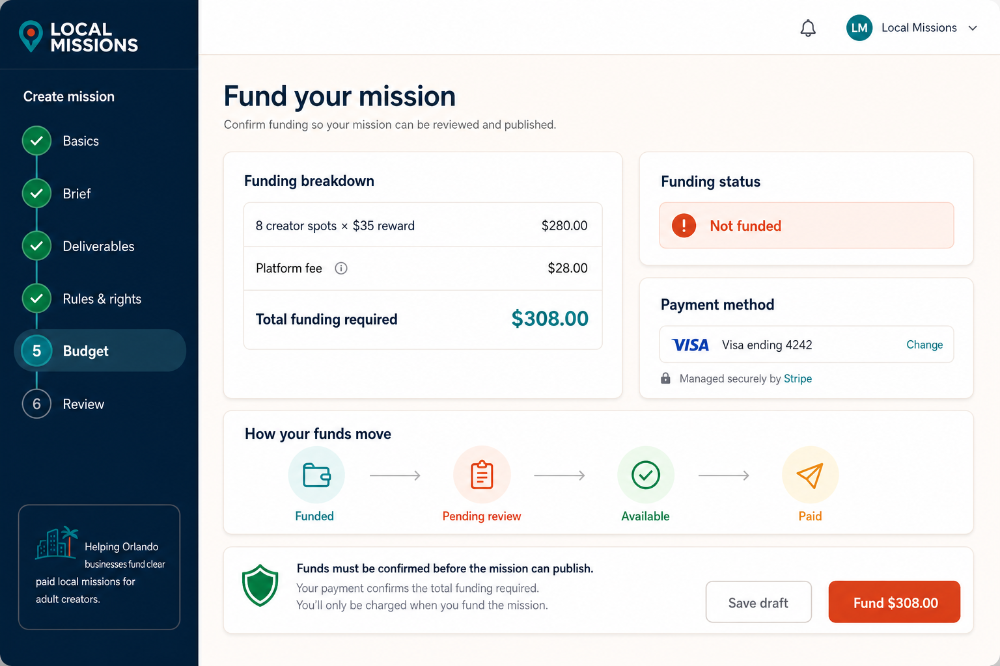

### 16 — Pass approval, then fund and publish

After manual pilot approval, the business reviews the final invoice and explicitly taps **Fund and Publish**. Stripe's authoritative success webhook moves the campaign to funded and permits publication; a failed or canceled payment leaves the approved campaign private and retryable. A pilot-status panel shows support coverage and whether funding or publishing is temporarily paused. The platform-wide `$25,000` unsettled-reward cap is enforced before new funding. The provisional operating-reserve panel can show **Ready**, **Attention**, or **New funding paused**: finance is warned below 125% coverage, and **Fund and Publish** is disabled below 100% of the greater of `$5,000` or 10% of trailing-90-day gross payment volume plus all unresolved payment exposure. The pause creates no new business charge and preserves the approved campaign for retry. It never delays creator transfers or refunds already owed. The rendered screen predates ADR-012 and ADR-044 and will be regenerated during M2.

Next: successful funding makes the mission discoverable to eligible creators.

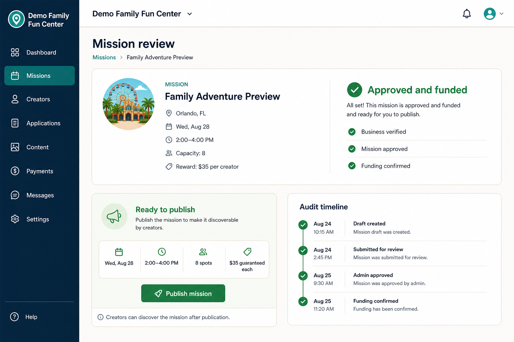

### 17 — Fill Community and Reach Slots

The business sees separate Community and Reach capacity. Local Missions assigns Community creators from the qualified rotation; the business has 24 hours to submit a documented safety, direct-conflict, or unmet preapproved-requirement objection for platform review. It cannot browse or cycle through Community candidates, and popularity, appearance, audience size, or subjective preference cannot remove someone. Creator locality appears only as **Under 10**, **10–25**, **25–50**, or **More than 50 miles**, based on ZIP-area centers—not exact addresses. Community campaigns launch even when every Reach integration is unavailable. Up to 20% may become Reach Slots using consented, verified local-audience bands and fixed bonuses, but each platform starts disabled until its own approved connection passes feasibility, security, privacy, provider-policy, reliability, retention, and operational review. Reach proof comes only from an official platform or approved read-only analytics connection—never screenshots or self-entered counts. Tiers last 90 days and may receive one 14-day documented-provider-outage grace; unavailable proof disables only that platform's Reach tier, not Community opportunities or an already accepted reward. Businesses still see only the tier and validity, never raw analytics. The rendered screen predates these controls and will be regenerated during M2.

Next: a Community assignment confirms automatically after the objection window, or Local Missions reviews a permitted objection and rotates a replacement when valid.

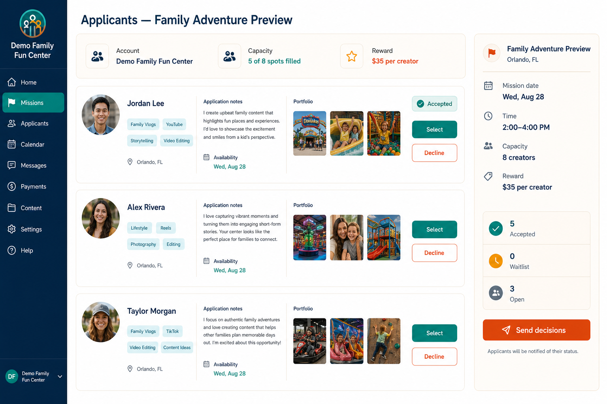

### 18 — Review submitted work

The business checks the delivered files and disclosure against the accepted checklist. It has 48 hours to approve, request the single included correction, or open an evidence-backed dispute; no valid action automatically approves the full reward. The creator sees any correction request in screen 08.

Next: **Approve work** advances the reward to Available; **Request revision** returns the task to the creator.

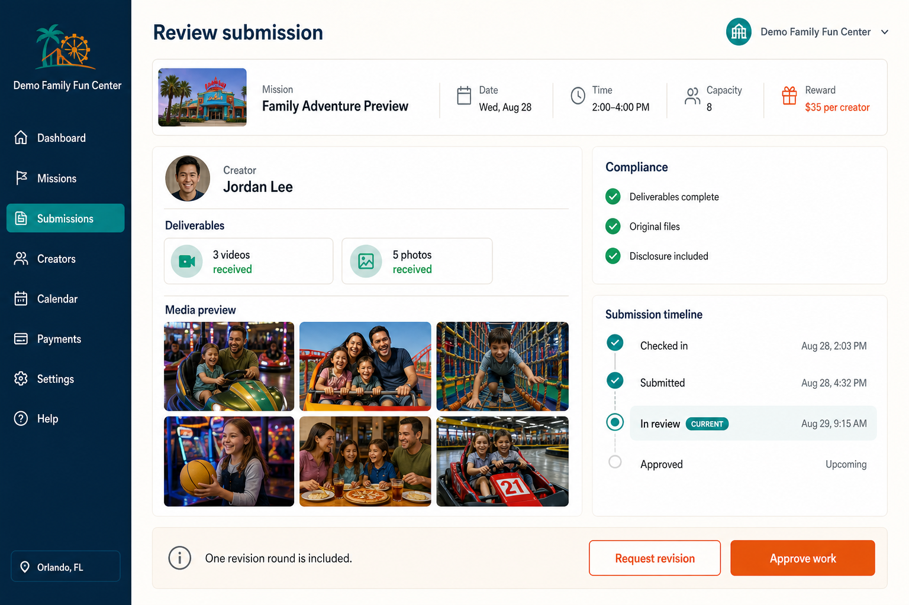

### 19 — Approve the reward and view results

The results view closes the loop: approved work, transparent payment state, delivered-media totals, completed creator visits, automatic original-payment refunds for no-payout slots, and optional Local Pass results. Approval or auto-approval automatically queues the locked creator reward for transfer to the creator's Stripe-hosted connected account; there is no additional business-controlled payout-release step. Each creator shares an opaque campaign link; a customer claims on a lightweight webpage without installing the app, verifies a mobile number by one-time SMS code without creating an account, and presents a rotating QR for venue staff to scan. The same verified number can recover the active pass but can claim only one pass per campaign. The pass is single-use, venue-specific, and valid for seven days, and first claim locks creator attribution. A successful claim reserves one unit of the approved offer. The business can pause new claims but must honor active passes; inventory cannot be reduced below active reservations. Equal-or-greater substitutions must be preapproved or accepted by the customer, documented emergency closures extend passes, and customers can report refusals. Marketing consent is separate and unchecked. Businesses see aggregate claims, verified redemptions, conversion, and actual campaign cost per verified redemption—not customer identity or phone number. Encrypted phone data is deleted 30 days after redemption/expiry, and the non-reversible deduplication/audit linkage is removed after 12 months. The app never labels these results as purchases, sales, or incremental customers without stronger future evidence, and Local Pass performance never changes guaranteed creator pay. The campaign statement shows that the business pays only for completed creator slots.

Next: Stripe transfer and payout webhooks move the creator's screen from **Transfer pending** to **Paid**; the business can observe status but cannot withhold an earned reward.

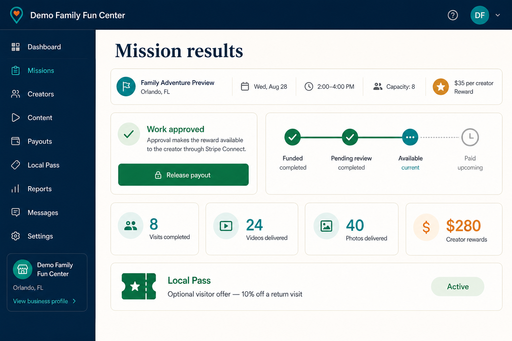

## Color and interaction system

- Midnight Navy `#102A43`: navigation, security, and high-trust surfaces.
- Orlando Lagoon `#007C83`: links, selection, progress, and informational states.
- Sunset Tangerine `#CF3F1F`: primary creation and commitment actions.
- Warm Sand `#FFF7ED`: friendly background that keeps long workflows from feeling clinical.
- Palm Green `#137A50`: verified, approved, complete, and available states.
- Golden Hour `#D97706`: pending, attention, and revision states.
- Slate `#526273`: secondary copy.
- White `#FFFFFF` and warm border `#E5D8C8`: cards and separation.

Color is never the only status signal: every state also uses text and an icon. Buttons remain at least 44 points high in the implementation. Destructive, irreversible, legal, or financial actions require explicit confirmation.

## Generation notes

The assets were generated with OpenAI’s built-in image generation in text-to-image mode, one call per distinct screen. The prompt recipe held these elements constant:

- Native iOS portrait UI for creator screens; responsive 1440px landscape dashboard for business screens.
- The Sunset + Lagoon palette above.
- Synthetic Orlando context and a single demo mission.
- Crisp, short UI copy and accessible contrast.
- No legal escrow claim, follower counts, engagement metrics, or real personal data.
- Exact cross-role continuity for the final business correction pass.

The individual PNGs are the primary artifacts. The MP4 files are silent three-seconds-per-screen slideshows generated from those PNGs. Final implementation should use real components and text, not rasterize these images into the app.

## Implementation handoff

This package supports M0 product-contract discussion and future M2 screen work, but it does not complete either milestone. Before coding, the team still needs to settle the product name, role/account model, SSO providers, funding/refund policy, approval ownership, revision and dispute rules, legal payment language, and the exact state-transition tables in `plans.md`.
